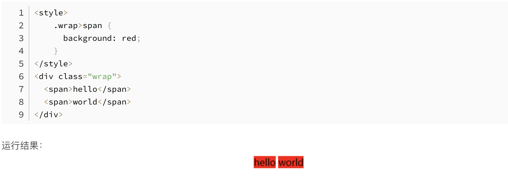
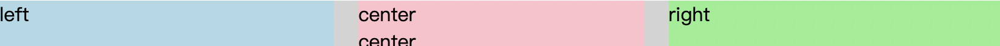
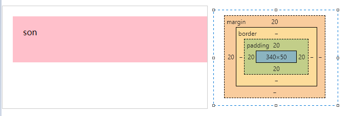

# CSS面试题集合

## 1. CSS sprites的原理和优缺点

Css Sprites在国内很多人叫css精灵，是一种网页图片应用处理方式。它允许将一个页面涉及到的所有零星图片都包含到一张大图中， 利用CSS的“background-image”，“background- repeat”，“background-position”的组合进行背景定位， 访问页面时避免图片载入缓慢的现象。
优点：大大减少了请求次数
确定：定位不太好控制，多用于小图标的展示，不易维护。

## 2. 什么是FOUC，如何避免FOUC

FOUC：文档样式短暂失效(Flash of Unstyled Content)。
简单来说就是使用当文档结构表（HTML）先于样式表（CSS）渲染，这时候渲染出来的是没有样式的页面，然后当浏览器解析到样式表的时候，又结合样式表重新渲染了一遍文档，这时候页面就添加了样式，而前后两次的页面变换会出现一瞬间的闪烁。
解决办法也很简单，就是确保样式表最先渲染即可，比如css样式表添加到head标签中。

## 3.  要让Chrome支持小于12px的文字怎么做

Chrome 中有最小字号的限制，一般为 12px。原因是 Chrome 认为小于这个字号会影响阅读。
当需要小于 12px 字体的时候，有以下几个方法可以使用。

- -webkit-text-size-adjust:none; 这个属性在高版本的 Chrome 中已经被废除。
- 使用 transform: scale(0.5, 0.5)，但使用 transform 需要注意下面几点：
  - transform 对行内元素无效，因此要么使用 display: block; 要么使用 display: inline-block;
  - transform 即使进行了缩放，原来元素还是会占据对应的位置。因此需要做调整，最好是在外面再包一层元素，以免影响其他元素。
作为图片。最好的办法还是进行切图，或者就不要使用小于 12px 的字体。

## 4.不使用border画出1px高的线，在不同浏览器的标准和怪异模式下都能保持效果一样

```html
 <div style="width: 100%;height: 1px;background:black"></div>
```

## 5.实现单行文本居中和多行文本左对齐并超出显示"..."

```html
<div class="container">
 <h2><p><em>我是单行标题居中</em></p></h2>
 <h2><p><em>我是两行标题两行标题两行标题居左</em></p></h2>
 <h2><p>
  <em>我是超过两行的标题最后点号省略我是超过两行的标题最后点号省略我是超过两行的标题最后点号省略省略省略</em>
  </p></h2>
</div>

<style>
  em {
 position: relative;
 font-style: normal;
 text-align: left;
 overflow : hidden;
 text-overflow: ellipsis;
 display: -webkit-box;
 -webkit-line-clamp: 2;
 -webkit-box-orient: vertical;
}

.container{
 width:320px;
 padding:0 10px;
 margin:10px auto;
 background: #ddd;
}

.container p {
 display: inline-block;
 text-align: center;
}

h2{
 text-align: center;
 padding:10px 0;
}

</style>
```

## 6.怎么让英文单词的首字母大写

```css
.demo {
  text-transform: capitalize;
}
```

text-transform 属性控制文本的大小写，是CSS2.1的属性，兼容性问题不大。
属性值是关键字，有4+1种，这个1是实验性属性值。

```css
text-transform: capitalize;
text-transform: uppercase;
text-transform: lowercase;
text-transform: none;
text-transform: full-width;
```

capitalize:强制每个单词的首字母转换为大写。

uppercase:强制所有字符被转换为大写。

lowercase:强制所有字符被转换为小写。

none:阻止所有字符的大小写被转换。

full-width（实验性属性值）
这个关键字强制字符 — 主要是表意字符和拉丁文字 — 书写进一个方形里，并允许它们按照一般的东亚文字（比如中文或日文）对齐。

## 7.span与span之间有看不见的空白间隔是什么原因引起的？有什么解决办法？



原因： 元素被当成行内元素排版的时候，元素之间的空白符（空格、回车换行等）都会被浏览器转换成一个空白字符，这个字符的大小受font-size影响

```html
上面代码中的span可以明显地看到有间隔，解这几种决办法： 
1.去掉换行，将 span 写成一行

2.<span>hello</span><span>world</span> 

3.父元素使用 flex 布局：
.wrap {display: flex; flex-direction: row;} 

4.父元素设置 font-size: 0;，span 子元素再设置字体大小 
font-size: 16px; 

5.span 子元素设置 float: left

```

## 8.等高布局实现方式

方法一：table布局

```html
<div class="parent" style="background-color: lightgrey;">
    <div class="left" style="background-color: lightblue;">
        <p>left</p>
    </div>  
    <div class="centerWrap">
        <div class="center" style="background-color: pink;">
            <p>center</p>
            <p>center</p>
        </div>         
    </div> 
    <div class="right" style="background-color: lightgreen;">
        <p>right</p>
    </div>        
</div>
```

```css
<style>
body,p{margin: 0;}
.parent{
    display: table;
    width: 100%;
    table-layout: fixed;
}
.left,.centerWrap,.right{
    display: table-cell;
}
.center{
    margin: 0 20px;
}
</style>
```


方法二：absolute
设置子元素的top:0;bottom:0;使得所有子元素的高度都和父元素的高度相同，实现等高效果

```html
<div class="parent" style="background-color: lightgrey;">
    <div class="left" style="background-color: lightblue;">
        <p>left</p>
    </div>  
    <div class="center" style="background-color: pink;">
        <p>center</p>
        <p>center</p>
    </div>          
    <div class="right" style="background-color: lightgreen;">
        <p>right</p>
    </div>        
</div>
```

```css
<style>
body,p{margin: 0;}
.parent{
    position: relative;
    height: 40px;
}
.left,.center,.right{
    position: absolute;
    top: 0;
    bottom: 0;
}
.left{
    left: 0;
    width: 100px;
}
.center{
    left: 120px;
    right: 120px;
}
.right{
    width: 100px;
    right: 0;
}
</style>
```


方法三：flex
flex中的伸缩项目默认都拉伸为父元素的高度，也实现了等高效果

```html
<div class="parent" style="background-color: lightgrey;">
    <div class="left" style="background-color: lightblue;">
        <p>left</p>
    </div>  
    <div class="center" style="background-color: pink;">
        <p>center</p>
        <p>center</p>
    </div>          
    <div class="right" style="background-color: lightgreen;">
        <p>right</p>
    </div>        
</div>
```

```css
<style>
body,p{margin: 0;}
.parent{
    display: flex;
}
.left,.center,.right{
    flex: 1;
}
.center{
    margin: 0 20px;
}
</style>
```

方法四：grid布局

```html
<div class="parent" style="background-color: lightgrey;">
    <div class="left" style="background-color: lightblue;">
        <p>left</p>
    </div>  
    <div class="center" style="background-color: pink;">
        <p>center</p>
        <p>center</p>
    </div>          
    <div class="right" style="background-color: lightgreen;">
        <p>right</p>
    </div>        
</div>
```

```css
<style>
body,p{margin: 0;}
.parent{
    display: grid;
    grid-auto-flow: column;
    grid-gap:20px;
}
</style>
```

## 9.CSS优化、提高性能的方法

- 压缩CSS；
- 通过link方式加载，而不是@import；
- 复合属性其实分开写，执行效率更高，因为CSS最终也还是要去解析如 margin-left: left;

- 尽量少的使用嵌套，可以采用BEM的方式来解决命名冲突；
- 尽量少甚至是不使用标签选择器，这个性能实在是差，同样的还有*选择器；
- 利用继承，减少代码量；

- 慎重使用高性能属性：浮动、定位；
- 尽量减少页面重排、重绘；
- css雪碧图
- 自定义web字体，尽量少用
- 尽量减少使用昂贵属性，如box-shadow/border-radius/filter/透明度/:nth-child等
- 使用transform来变换而不是宽高等会造成重绘的属性

## 10.css3的:nth-child和:nth-of-type的区别是什么

:nth-child和:nth-of-type都是找对应元素父元素内子元素(仅包含当前父元素子元素不包含子元素的子元素),然后区别在于:nth-child是找出包含对应元素父元素内所有的子元素然后再去找到对应位置的元素后再去匹配选择器,nth-of-type是找出包含对应元素父元素内的子元素,然后根据样式选择器找到的元素的tag,把父元素内子元素所有对应tag种类分别取出排列后,分别比对对应的位置然后匹配选择器。

p:nth-child(n)，匹配所有p标签的父元素的第n个元素，并且这个元素是p标签，如果这个元素不是p标签，那么就不会匹配到
p:nth-of-type(n)，匹配所有p标签的父元素的第n个p标签元素

## 11.什么是视差滚动？如何实现视差滚动的效果？

什么是视差滚动：
就是在同一视角下，鼠标或者页面滚动时，不同元素以不同的速率跟随滚动，产生生动的效果。
如何实现视差滚动：
根据页面滚动高度的变化，JS相应调整不同元素的不同位移，常见的插件有

使用css形式实现视觉差滚动效果的方式有：

```css
background-attachment
transform:translate3D
```

方式一：background-attachment
作用是设置背景图像是否固定或者随着页面的其余部分滚动

scroll：默认值，背景图像会随着页面其余部分的滚动而移动
fixed：当页面的其余部分滚动时，背景图像不会移动
inherit：继承父元素background-attachment属性的值

方式二：transform:translate3D

```js
transform: css3 属性，可以对元素进行变换(2d/3d)，包括平移 translate,旋转 rotate,缩放 scale,等等。
perspective: css3 属性，当元素涉及 3d 变换时，perspective 可以定义我们眼睛看到的 3d 立体效果，即空间感。
```

事例：

```html
<style>
    html {
        overflow: hidden;
        height: 100%
    }

    body {
        /* 视差元素的父级需要3D视角 */
        perspective: 1px;
        transform-style: preserve-3d; 
        height: 100%;
        overflow-y: scroll;
        overflow-x: hidden;
    }
    #app{
        width: 100vw;
        height:200vh;
        background:skyblue;
        padding-top:100px;
    }
    .one{
        width:500px;
        height:200px;
        background:#409eff;
        transform: translateZ(0px);
        margin-bottom: 50px;
    }
    .two{
        width:500px;
        height:200px;
        background:#67c23a;
        transform: translateZ(-1px);
        margin-bottom: 150px;
    }
    .three{
        width:500px;
        height:200px;
        background:#e6a23c;
        transform: translateZ(-2px);
        margin-bottom: 150px;
    }
</style>
<div id="app">
    <div class="one">one</div>
    <div class="two">two</div>
    <div class="three">three</div>
</div>
```

而这种方式实现视觉差动的原理如下：

```html
容器设置上 transform-style: preserve-3d 和 perspective: xpx，那么处于这个容器的子元素就将位于3D空间中，
子元素设置不同的 transform: translateZ()，这个时候，不同元素在 3D Z轴方向距离屏幕（我们的眼睛）的距离也就不一样
滚动滚动条，由于子元素设置了不同的 transform: translateZ()，那么他们滚动的上下距离 translateY 相对屏幕（我们的眼睛），也是不一样的，这就达到了滚动视差的效果
```

## 12.inline、block、inline-block这三个属性值有什么区别？

inline： 行内元素，元素不独占一行，不可以修改宽高。

block： 块级元素，元素独占一行，可以修改宽高。

inline-block： 行内块级元素，元素不独占一行，并且可以修改宽高。

## 13.div垂直居中

方法一：绝对定位 + margin:auto

```html
<style>
    .parent{
      height: 400px;
      width: 100%;
      background-color: pink;
      position: relative;
    }
    .son{
      background-color: aqua;
      position: absolute;
      height: 100px;
      width: 100px;
      left:0;
      top: 0;
      bottom: 0;
      right: 0;
      margin: auto;     
    }
  </style>

  <div class="parent">
    <div class="son">
      son
    </div>
  </div>

```

方法二：绝对定位 + margin负间距 （知道元素具体的宽高）

```html
<style>
    .parent{
      height: 400px;
      width: 100%;
      background-color: pink;
      position: relative;
    }
    .son{
      background-color: aqua;
      position: absolute;
      height: 100px;
      width: 100px;
      left:50%;
      top: 50%;
      margin-top:-50px;
      margin-left: -50px;      
    }
  </style>

  <div class="parent">
    <div class="son">
      son
    </div>
  </div>

```


方法三：绝对定位 + transform

```html
<style>
    .parent{
      height: 400px;
      width: 100%;
      background-color: pink;
      position: relative;
    }
    .son{
      background-color: aqua;
      position: absolute;
      height: 100px;
      width: 100px;
      left:50%;
      top: 50%;
      transform: translate(-50%,-50%); // 自己的50%     
    }
  </style>

  <div class="parent">
    <div class="son">
      son
    </div>
  </div>

```

方法四：父元素flex布局

```html
<style>
    .parent{
      height: 400px;
      width: 100%;
      background-color: pink;
      display: flex;
      justify-content: center; //主轴方向居中
      align-items: center; //侧轴方向居中
    }
    .son{
      background-color: aqua;
      height: 100px;
      width: 100px;
    }
  </style>

  <div class="parent">
    <div class="son">
      son
    </div>
  </div>

```

## 14.页面导入样式时，使用link和@import有什么区别？

1. link是HTML标签，@import是css提供的。
2. link引入的样式页面加载时同时加载，@import引入的样式需等页面加载完成后再加载。
3. link没有兼容性问题，@import不兼容ie5以下。
4. link可以通过js操作DOM动态引入样式表改变样式，而@import不可以

## 15.元素竖向的百分比设置是相对容器的高度吗

元素竖向的百分比设置高度是相对父级的高度，但是margin 和padding 是参照父级的宽度来设置的。
```html
<style>
    .parent{
      height: 200px;
      width: 400px;
      border: 1px solid #ccc;     
    }
    .son{
      height: 25%;
      background-color: pink;
      margin-top: 5%;
      margin-left: 5%;
    }
</style>

<div class="parent">
    <div class="son">son</div>
</div>
```


上图所示，margin和padding的百分比是按照父元素宽度计算的

## 16.怎么让body高度自适应屏幕？为什么？

```css
html,body{
  height: 100%;
}
```
或者
```css
body{
  height: 100vh;
}
```
