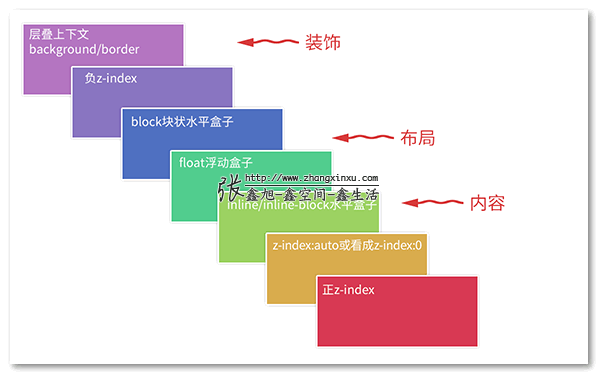

## 层叠(堆叠)上下文和层叠顺序
[资料参考](https://www.zhangxinxu.com/wordpress/2016/01/understand-css-stacking-context-order-z-index/)

### 什么是层叠上下文?

层叠上下文，英文称作”stacking context”. 是HTML中的一个三维的概念。如果一个元素含有层叠上下文，我们可以理解为这个元素在z轴上就“高人一等”。

你可以把「层叠上下文」理解为当官：网页中有很多很多的元素，我们可以看成是真实世界的芸芸众生。真实世界里，我们大多数人是普通老百姓们，还有一部分人是做官的官员。OK，这里的“官员”就可以理解为网页中的层叠上下文元素。

换句话说，页面中的元素有了层叠上下文，就好比我们普通老百姓当了官，一旦当了官，相比普通老百姓而言，离皇帝更近了，对不对，就等同于网页中元素级别更高，离我们用户更近了。

### 什么是层叠水平?

<strong>“层叠水平”英文称作”stacking level”，决定了同一个层叠上下文中元素在z轴上的显示顺序。</strong>

所有的元素都有层叠水平，包括层叠上下文元素，层叠上下文元素的层叠水平可以理解为官员的职级，1品2品，县长省长之类。然后，对于普通元素的层叠水平，我们的探讨仅仅局限在当前层叠上下文元素中。为什么呢？因为没有意义。

这么理解吧~ 上面提过元素具有层叠上下文好比当官，大家都知道的，这当官的家里都有丫鬟啊保镖啊管家啊什么的。所谓打狗看主人，A官员家里的管家和B官员家里的管家做PK实际上是没有意义的，因为他们牛不牛逼完全由他们的主子决定的。一人得道鸡犬升天，你说这和珅家里的管家和七侠镇娄知县县令家里的管家有可比性吗？李总理的秘书是不是分分钟灭了你村支部书记的秘书（如果有）。

翻译成术语就是：<strong>普通元素的层叠水平优先由层叠上下文决定，因此，层叠水平的比较只有在当前层叠上下文元素中才有意义。</strong>

### 什么是层叠顺序?

“层叠顺序”英文称作”stacking order”. 表示元素发生层叠时候有着特定的垂直显示顺序，注意，这里跟上面两个不一样，上面的<strong>层叠上下文和层叠水平是概念，而这里的层叠顺序是规则</strong>。

在CSS2.1的年代，在CSS3还没有出现的时候（注意这里的前提），层叠顺序规则遵循下面这张图

### 层叠准则

1. 谁大谁上：当具有明显的层叠水平标示的时候，如识别的z-indx值，<strong>在同一个层叠上下文领域，层叠水平值大的那一个覆盖小的那一个。</strong>通俗讲就是官大的压死官小的。
2. 后来居上：当元素的层叠水平一致、层叠顺序相同的时候，在DOM流中处于后面的元素会覆盖前面的元素。

### 层叠上下文的特性

- 层叠上下文的层叠水平要比普通元素高
- 层叠上下文可以阻断元素的混合模式
- 层叠上下文可以嵌套，内部层叠上下文及其所有子元素均受制于外部的层叠上下文。
- 每个层叠上下文和兄弟元素独立，也就是当进行层叠变化或渲染的时候，只需要考虑后代元素。
- 每个层叠上下文是自成体系的，当元素发生层叠的时候，整个元素被认为是在父层叠上下文的层叠顺序中。

### 层叠上下文的创建

- 根堆叠上下文（也就是Html元素,我们所有的元素排序都是在此上下文中进行的）
- 定位元素与传统层叠上下文
    - 对于包含有position:relative/position:absolute的定位元素，以及FireFox/IE浏览器（不包括   Chrome等webkit内核浏览器）（目前，也就是2016年初是这样）下含有position:fixed声明的定位元素，当其z-index值不是auto的时候，会创建层叠上下文。
- CSS3与新时代的层叠上下文

    - z-index值不为auto的flex项(父元素display:flex|inline-flex)
    - 元素的opacity值不是1
    - 元素的transform值不是none
    - 元素mix-blend-mode值不是normal
    - 元素的filter值不是none
    - 元素的isolation值是isolate
    - will-change指定的属性值为上面任意一个
    - 元素的-webkit-overflow-scrolling设为touch

## z-index的理解

z-index在某些情况下可以影响层叠水平

z-index属性只能在设置了position: relative | absolute | fixed的元素和父元素设置了 display: flex属性的子元素中起作用，在其他元素中是不作用的。