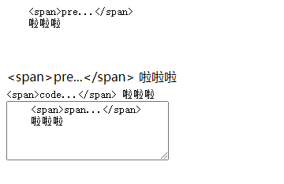

# html面试题集合

## 1. 对html中的置换(替换)元素和非置换元素的理解

替换元素：一个内容不受CSS视觉格式化模型控制，CSS渲染模型并不考虑对此内容的渲染，且元素本身一般拥有固有尺寸（宽度，高度，宽高比）的元素，被称之为置换元素。简单来说就是浏览器通过其标签的元素属性来判断显示具体的内容的元素。

举例说明

```html
元素：浏览器根据src来显示图片内容；
<input>元素：浏览器根据其type值来选择显示输入框还是其他类型。
html中的替换元素有：, <input>, <textarea>, <select>, <object>
```

非替换元素：相对替换元素来说的，html中大多数都是非替换元素，他们直接将内容告诉浏览器，直接显示出来，通常都是双标签。html中大多数都是非替换元素，他们直接将内容告诉浏览器，直接显示出来，通常都是双标签。

## 2. html元素显示的优先级

在html中，帧元素（frameset）的优先级最高，表单元素比非表单元素的优先级要高。
表单元素:
  文本输入框，密码输入框，单选框，复选框，文本输入域，列表框等等
非表单元素
  链接（a），div, table, span 等等

有窗口元素比无窗口元素的优先级高
有窗口元素
  select元素，object元素，以及frames元素等等
无窗口元素
  大部分html元素都是无窗口元素

另外 z-index 属性也可以改变显示优先级，但只对同种类型的元素才有效。

## 3. input元素中readonly和disabled属性的理解

相同点：都会使文本框变成只读，不可编辑。

不同点：

- readonly只对input和textarea有效，disabled对所有表单元素都有效。
- 如果一个输入项的disabled设为true，则该表单输入项不能获取焦点，用户的所有操作（鼠标点击和键盘输入等）对该输入项都无效，<font color="red">最重要的一点是当提交表单时，这个表单输入项将不会被提交。</font>
- 而readonly只是针对文本输入框这类可以输入文本的输入项，如果设为true，用户只是不能编辑对应的文本，但是仍然可以聚焦焦点，并且在提交表单的时候，该输入项会作为form的一项提交。

## 4. 对重绘和重排的理解，以及如何优化

重绘是指一个元素<font color="red">外观的改变(并没有影响几何属性的改变)</font>所触发的浏览器行为，浏览器会根据元素的新属性重新绘制，使元素呈现新的外观。

<font color="red">触发重绘的条件：改变元素外观属性。如：color，background-color等</font>

引起重绘的属性：

外观属性包括界面、文字等可用状态向量描述的属性，如：

```html
界面：appearance、outline、background、mask、box-shadow、box-reflect、filter、opacity、clip、border-radius、background-size、visibility

文字：text、font、word
```
重排(回流)：
当渲染树中的一部分(或全部)因为元素的规模尺寸，布局，隐藏等改变而需要重新构建, 这就称为回流(reflow)。每个页面至少需要一次回流，就是在页面第一次加载的时候。
重绘和重排的关系：在回流的时候，浏览器会使渲染树中受到影响的部分失效，并重新构造这部分渲染树，完成回流后，浏览器会重新绘制受影响的部分到屏幕中，该过程称为重绘。
所以，重排必定会引发重绘，但重绘不一定会引发重排。

引起重排的属性和方法：
改变元素几何信息（大小和位置），都会引起，如：

- 添加或删除可见的DOM元素

- 元素位置改变，或者使用动画

- 元素的尺寸改变（外边距、内边距、边框厚度、宽高等几何属性）

- 内容改变（例如：文本改变或图片被另一个不同尺寸的图片替代、在input框输入内容）

- 浏览器窗口尺寸改变（resize事件发生时）

- 页面渲染初始化

- 设置style属性的值

- 计算offsetWidth、offsetHeight、offsetTop和offsetLeft等布局信息

- 激活CSS伪类（如 :hover）

- 查询某些属性或调用某些方法（如：getComputedStyle()、getBoundingClientRect()）

几何属性包括布局、尺寸等可用数学几何衡量的属性：

```html
布局：display、float、position、list、table、flex、columns、grid
尺寸：margin、padding、border、width、height
```

获取布局信息的属性或方法：

```html
 offsetTop、offsetLeft、offsetWidth、offsetHeight

 scrollTop、scrollLeft、scrollWidth、scrollHeight

 clientTop、clientLeft、clientWidth、clientHeight

 getComputedStyle()、getBoundingClientRect()
```

优化
  我们要减少重绘和重排就是要减少对渲染树的操作，则我们可以合并多次的DOM和样式的修改。并减少对style样式的请求。
- 直接改变元素的className
- display：none；先设置元素为display：none；然后进行页面布局等操作；设置完成后将元素设置为display：block；这样的话就只引发两次重绘和重排；
- 不要经常访问浏览器的flush队列属性；如果一定要访问，可以利用缓存。将访问的值存储起来，接下来使用就不会再引发回流；
- 使用cloneNode(true or false) 和 replaceChild 技术，引发一次回流和重绘；
- 将需要多次重排的元素，position属性设为absolute或fixed，元素脱离了文档流，它的变化不会影响到其他元素；
- 如果需要创建多个DOM节点，可以使用DocumentFragment创建完后一次性的加入document；
- 给动画的HTML元件使用fixed或absolute的position，那么修改他们的css是不会重排
- 避免在大量元素上使用:hover
- 分离读写操作
- 避免使用Table布局
- 避免设置多层内联样式

## 5.`<script>`、`<script async>`和`<script defer>`的区别

```html
<script>立即加载并执行相应的脚本。会阻塞后面的文档加载；
<script async>异步加载，脚本执行和后续文档代码加载同时进行；
<script defer>异步加载，脚本的执行需等倒所有文档加载完才执行。
```

## 6.对影子(Shadow)DOM的了解

```html
Shadow DOM是HTML的一个规范 ，它允许浏览器开发者封装自己的HTML标签、CSS样式和特定的javascript代码，同时也可以让开发人员创建类似<video>这样的自定义一级标签，创建这些新标签内容和相关的的API被称为Web Component。
```

## 7.div模拟Textera

```html
<!DOCTYPE html>
<html>
<head>
    <title>用一个div模拟textarea的实现</title>
</head>
<style>
.edit{
    width: 300px;
    height: 200px;
    padding: 5px;
    border: solid 1px #ccc;
    resize: both;
    overflow:auto;
}
</style>
<body>
    <h3>用一个div模拟textarea的实现</h3>
      <div class="edit" contenteditable="true">
        这里是可以编辑的内容，配合容器的 overflow ，多行截断，自定义滚动条，简直好用的不要不要的。
    </div>
</body>
</html>
```

## 8.html5都有哪些新的特性？移除了哪些元素

### 新特性

```html
拖放（Drag and drop）API
语义化标签（header、nav、footer、section、article、aside）
音频、视频（audio、video）API
画布（canvas）API
地理定位（Geolocation）API
本地离线存储（localStorage），即长期存储数据，浏览器关闭后数据不丢失
会话存储（sessionStorage），即数据在浏览器关闭后自动删除
表单控件（calender、date、time、url、email、search）
新的技术（webworker、websocket）
```

### 移除元素

```html
纯表现的元素：basefont（默认字体）、big（大字体）、center（水平居中）、font（字体标签）、s、strike（中横线）、tt（文本等宽）、u（下划线）
对可用性产生负面影响的元素：frame、frameset、noframes
```

## 9.跨页面通信解决方案

### 方案一 storage

WindowEventHandlers.onstorage 属性包含一个在 storage 事件触发时运行的事件处理程序。当更改存储时会触发事件处理程序。

```html
<div id="app"></div>
<button id="tab">新开 Tab</button>
<button id="l-btn">触发 LocalStorage 更新</button>
<button id="s-btn">触发 SessionStorage 更新</button>
<script>
  window.onstorage = function(e) {
    console.log(`The ${e.key}  key has been changed from ${e.oldValue}  to  ${e.newValue} .`);
  };
 
  document.getElementById('tab').onclick = function () {
    window.open('xxx');
  }
 
  document.getElementById('l-btn').onclick = function () {
    localStorage.setItem('storage1', Date.now())
  }
 
  document.getElementById('s-btn').onclick = function () {
    sessionStorage.setItem('storage1', Date.now())
 }
</script>
```

Tips:
该事件不在导致数据变化的当前页面触发
sessionStorage（❎）不能触发 storage 事件 ， localStorage（✅）可以。
如果修改的值未发生改变，将不会触发 onstorage 事件。

### 方案二 BroadCast Channel

BroadcastChannel 接口代理了一个命名频道，可以让指定 origin 下的任意 browsing context 来订阅它。它允许同源的不同浏览器窗口，Tab页，frame或者 iframe 下的不同文档之间相互通信。通过触发一个 message 事件，消息可以广播到所有监听了该频道的 BroadcastChannel 对象。
说到 BroadCast Channel 不得不说一下 postMessage，他们二者的最大区别就在于 postMessage 更像是点对点的通信，而 BroadCast Channel 是广播的方式，点到面。

发送方

```html
// 创建
const broadcastChannel = new BroadcastChannel('channelName');
 
// 监听消息
broadcastChannel.onmessage = function(e) {
    console.log('监听消息:', e.data);
};
 
// 发送消息
broadcastChannel.postMessage('测试：传送消息');
 
// 关闭
broadcastChannel.close();
复制代码
```

接收方

```html
<div id="app"></div>
  <button id="tab">新开 Tab</button>
  <button id="l-btn">发送消息</button>
  <button id="s-btn">关闭</button>
  <script>
    // 创建
    const broadcastChannel = new BroadcastChannel('channelName');
 
    // 监听消息
    broadcastChannel.onmessage = function(e) {
        console.log('监听消息:', e.data);
    };
 
    document.getElementById('tab').onclick = function () {
      window.open('xxx');
    }
 
    document.getElementById('l-btn').onclick = function () {
      // 发送消息
      broadcastChannel.postMessage('测试，传送消息，我发送消息啦。。。');
    }
 
    document.getElementById('s-btn').onclick = function () {
      // 关闭
      broadcastChannel.close();
    }
 
  </script>
复制代码
```

### 方案三 Service Worker

Service Worker 是一个可以长期运行在后台的 Worker，能够实现与页面的双向通信。多页面共享间的 Service Worker 可以共享，将 Service Worker 作为消息的处理中心（中央站）即可实现广播效果。

```html
<div id="app"></div>
<button id="tab">新开 Tab</button>
<button id="l-btn">发送消息</button>
<script>
  /* 判断当前浏览器是否支持serviceWorker */
  if ('serviceWorker' in navigator) {
    /* 当页面加载完成就创建一个serviceWorker */
    window.addEventListener('load', function () {
      /* 创建并指定对应的执行内容 */
      /* scope 参数是可选的，可以用来指定你想让 service worker 控制的内容的子目录。在这个例子里，我们指定了 '/'，表示 根网域下的所有内容。这也是默认值。*/
      navigator.serviceWorker.register('./serviceWorker.js', { scope: './' })
        .then(function (registration) {
        console.log('ServiceWorker registration successful with scope: ', registration.scope);
      })
        .catch(function (err) {
        console.log('ServiceWorker registration failed: ', err);
      });
    });
 
    // 监听消息
    navigator.serviceWorker.addEventListener('message', function (e) {
      const data = e.data;
      console.log('我接受到消息了：', data);
    });
 
    document.getElementById('l-btn').onclick = function () {
      navigator.serviceWorker.controller && navigator.serviceWorker.controller.postMessage('测试，传送消息，我发送消息啦。。。');
    };
  }
</script>
```

```html
/* 监听安装事件，install 事件一般是被用来设置你的浏览器的离线缓存逻辑 */
this.addEventListener('install', function (event) {
  /* 通过这个方法可以防止缓存未完成，就关闭serviceWorker */
  event.waitUntil(
    /* 创建一个名叫V1的缓存版本 */
    caches.open('v1').then(function (cache) {
      /* 指定要缓存的内容，地址为相对于跟域名的访问路径 */
      return cache.addAll(['./index.html']);
    })
  );
});
 
/* 注册fetch事件，拦截全站的请求 */
this.addEventListener('fetch', function (event) {
  event.respondWith(
    // magic goes here
 
    /* 在缓存中匹配对应请求资源直接返回 */
    caches.match(event.request)
  );
});
 
/* 监听消息，通知其他 Tab 页面 */
this.addEventListener('message', function(event) {
  this.clients.matchAll().then(function(clients) {
    clients.forEach(function(client) {
      // 这里的判断目的是过滤掉当前 Tab 页面，也可以使用 visibilityState 的状态来判断
      if(!client.focused) {
        client.postMessage(event.data)
      }
    })
  })
})
```
service workers 本质上充当 Web 应用程序、浏览器与网络（可用时）之间的代理服务器。所以本质上来说 Service Worker 并不自动具备“广播通信”的功能，需要改造 Service Worker 添加些代码，将其改造成消息中转站。在 Service Worker 中监听了message事件，获取页面发送的信息。然后通过 self.clients.matchAll() 获取当前注册了 Service Worker 的所有页面，通过调用每个的 postMessage 方法，向页面发送消息。这样就把从一处（某个Tab页面）收到的消息通知给了其他页面。


### 方案四 SharedWorker

SharedWorker 接口代表一种特定类型的 worker，可以从几个浏览上下文中访问，例如几个窗口、iframe 或其他 worker。它们实现一个不同于普通 worker 的接口，具有不同的全局作用域, SharedWorkerGlobalScope。

```html
// 创建共享线程对象
let worker = new SharedWorker("./sharedWorker.js");
 
// 手动启动端口
worker.port.start();
 
// 处理从 worker 返回的消息
 worker.port.onmessage = function (val) {
    ...
 };
```

```html
<button id="tab">新开 Tab</button>
<button id="l-btn">点赞</button>
<p><span id="likedCount">还没有人点赞</span></span>👍</p>

<script>
 let likedCountEl = document.querySelector("#likedCount");
 
 let worker = new SharedWorker("./sharedWorker.js");
 
 console.log('worker.port', worker.port);
 
 worker.port.start();
 
 // 监听消息
 worker.port.onmessage = function (val) {
   likedCountEl.innerHTML = val.data;
 };
 
 document.getElementById('tab').onclick = function () {
   // IP 地址为本地起的服务
   const windowOpen = window.open('http://127.0.0.1:5500/CrossPageCommunication/sharedWorker/index.html');
 }
 
 document.getElementById('l-btn').onclick = function () {
   worker.port.postMessage('点赞了');
 };
</script>
```
sharedWorker.js

```js
let a = 666;
console.log('shared-worker');
onconnect = function (e) {
 const port = e.ports[0];
 console.log('shared-worker connect');
 
 // 不能使用这种方式监听事件
 // port.addEventListener('message', () => {
 //   port.postMessage(++a);
 // });
 
 port.postMessage(a);
 
 port.onmessage = () => {
   port.postMessage(++a);
 };
 console.log('当前点赞次数:', a);
};
```

如果要使 SharedWorker 连接到多个不同的页面，这些页面必须是同源的（相同的协议、host 以及端口）。
Shared Worker 在实现跨页面通信时的，它无法主动通知所有页面，需要刷新页面或者是定时任务来检查是否有新的消息。

## 10.video标签

| 属性 | 值 | 描述 |
| :-----:| :----: | :----: |
| autoplay  | autoplay | 如果出现该属性，则视频在就绪后马上播放
| controls  | controls | 如果出现该属性，则向用户显示控件，比如播放按钮
| height  | pixels |  设置视频播放器的高度
| loop  | loop |  如果出现该属性，则当媒介文件完成播放后再次开始播放
| preload  | preload | 如果出现该属性，则视频在页面加载时进行加载，并预备播放。如果使用 "autoplay"，则忽略该属性
| src  | url |  要播放的视频的 URL
| width  | pixels | 设置视频播放器的宽度

## 11.渐进式渲染是什么

渐进式渲染是在网页中缓慢渲染数据的行为，以在用户的​​互联网连接或设备速度太慢时增加用户体验。
渐进式呈现是用于提高网页性能（尤其是提高用户感知的加载速度），以尽快呈现页面的技术。

## 12.html直接输入多个空格为什么只能显示一个空格？

该行为由 CSS white-space 控制，其默认值 normal 的表现即为多个空格压缩成一个

## 13.在新窗口打开链接的方法是什么？那怎么设置全站链接都在新窗口打开？
```js
<a href="#" target="_blank"></a>
// 
<head>
    <base target="_blank">
</head>
```

## 14.如何原样输出HTML代码，不被浏览器解析？
- pre code标签：需要转义特殊字符
- html转义
- textarea标签
```html
 <pre>
    &lt;span&gt;pre...&lt;/span&gt;
    啦啦啦
  </pre>
  <br />
  &lt;span&gt;pre...&lt;/span&gt;
  啦啦啦
  <br />
  <code>
    &lt;span&gt;code...&lt;/span&gt;
    啦啦啦
  </code>

  <br/>
  <textarea>
    <span>span...</span>
    啦啦啦
  </textarea>
```
效果如下

