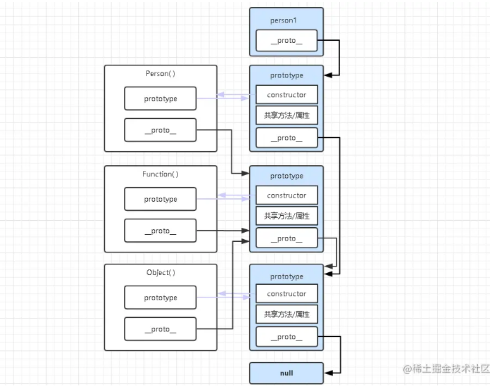
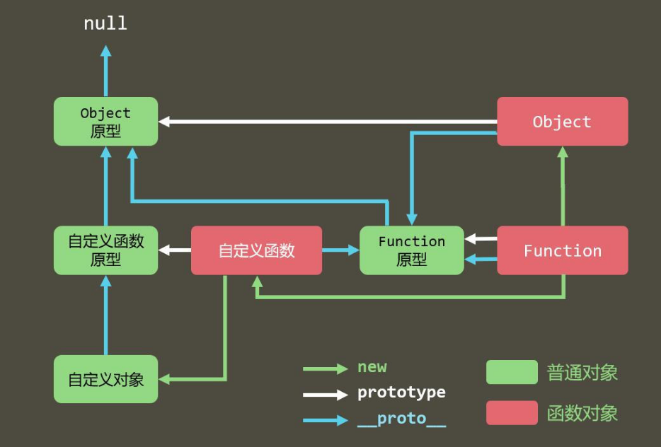
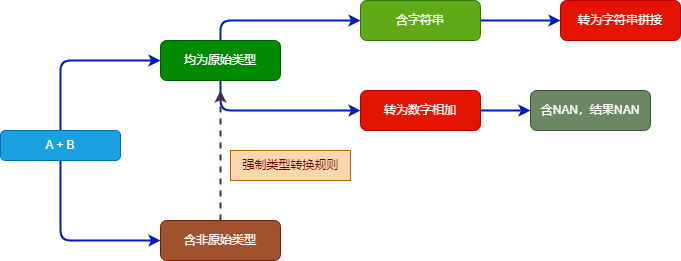

# JS考点汇总

- [JS考点汇总](#js考点汇总)
  - [1.typeof('abc')和typeof 'abc'都是string, 那么typeof是操作符还是函数](#1typeofabc和typeof-abc都是string-那么typeof是操作符还是函数)
  - [2.你理解的"use strict";是什么?使用它有什么优缺点？](#2你理解的use-strict是什么使用它有什么优缺点)
  - [3.”attribute“和“property”有什么不同](#3attribute和property有什么不同)
  - [4.对new操作符符理解，手动实现一个new方法](#4对new操作符符理解手动实现一个new方法)
  - [5.手写call,apply,bind](#5手写callapplybind)
  - [6.判断字符串是否是回文](#6判断字符串是否是回文)
  - [7.对象遍历方法Object.keys()和for...in的区别](#7对象遍历方法objectkeys和forin的区别)
  - [8.Object.defineProperty方法](#8objectdefineproperty方法)
  - [9.为什么会有跨域问题？怎么解决跨域？](#9为什么会有跨域问题怎么解决跨域)
  - [10.说说你对IIFE的理解](#10说说你对iife的理解)
  - [11.window对象和document对象有什么区别](#11window对象和document对象有什么区别)
  - [12.创建对象的几种方式](#12创建对象的几种方式)
  - [13.写一个使两个整数进行交换的方法（不能使用临时变量）](#13写一个使两个整数进行交换的方法不能使用临时变量)
  - [14.JS事件和任务](#14js事件和任务)
    - [宏任务和微任务有哪些](#宏任务和微任务有哪些)
    - [任务执行顺序](#任务执行顺序)
    - [练习题](#练习题)
    - [宏任务之间的执行顺序](#宏任务之间的执行顺序)
  - [15.web worker](#15web-worker)
  - [16.document的load 和ready有什么区别？](#16document的load-和ready有什么区别)
  - [17.理解constructor、prototype、\_\_proto\_\_和原型链](#17理解constructorprototype__proto__和原型链)
  - [18.什么是原型和原型链](#18什么是原型和原型链)
  - [19.如何实现a==1 \&\& a==2 \&\& a==3返回true？](#19如何实现a1--a2--a3返回true)
  - [20. js继承实现方式及优缺点](#20-js继承实现方式及优缺点)
    - [es6 Class继承](#es6-class继承)
  - [21.offset、client、scroll系列理解](#21offsetclientscroll系列理解)
    - [offset系列](#offset系列)
      - [obj.offsetWidth](#objoffsetwidth)
      - [obj.offsetHeight](#objoffsetheight)
      - [offsetLeft](#offsetleft)
      - [obj.offsetTop](#objoffsettop)
    - [client系列](#client系列)
    - [scroll系列](#scroll系列)
  - [22.JS原始类型有哪些](#22js原始类型有哪些)
  - [23.改造下面的代码，使之输出0 - 9](#23改造下面的代码使之输出0---9)
  - [24. var、let、const的区别](#24-varletconst的区别)
        - [变量提升](#变量提升)
          - [关于 let,var和function](#关于-letvar和function)
        - [暂时性死区](#暂时性死区)
        - [块级作用域](#块级作用域)
        - [重复声明](#重复声明)
        - [修改声明的变量](#修改声明的变量)
  - [25.setTimeout、setInterval 和 requestAnimationFrame 之间的区别](#25settimeoutsetinterval-和-requestanimationframe-之间的区别)
  - [26.手写Promise](#26手写promise)
  - [27. 手写call、apply、bind](#27-手写callapplybind)
  - [28. 手写new](#28-手写new)
  - [29. new的工作原理、new和字面量创建对象的区别？](#29-new的工作原理new和字面量创建对象的区别)
  - [30. V8 下的垃圾回收机制是怎么样的？](#30-v8-下的垃圾回收机制是怎么样的)
        - [回收策略](#回收策略)
      - [回收算法](#回收算法)
        - [Scavenge算法（用于新生代垃圾回收机制）](#scavenge算法用于新生代垃圾回收机制)
        - [Mark-sweep(标记清除) 和 Mark-compact（标记压缩） 算法（用于老生代垃圾回收机制）](#mark-sweep标记清除-和-mark-compact标记压缩-算法用于老生代垃圾回收机制)
  - [31. null和undefined的区别](#31-null和undefined的区别)
  - [32. 防抖和节流](#32-防抖和节流)
  - [33. == 比较规则](#33--比较规则)
  - [34. A + B 加法运算规则](#34-a--b-加法运算规则)
  - [显示转换](#显示转换)
  - [35. 必包是什么，优缺点是什么](#35-必包是什么优缺点是什么)

## 1.typeof('abc')和typeof 'abc'都是string, 那么typeof是操作符还是函数

typeof 是操作符，不是函数。可以添加括号，但是括号的作用是进行分组而非函数的调用

## 2.你理解的"use strict";是什么?使用它有什么优缺点？

设立"严格模式"的目的，主要有以下几个：

- 消除Javascript语法的一些不合理、不严谨之处，减少一些怪异行为;

- 消除代码运行的一些不安全之处，保证代码运行的安全；
  
- 提高编译器效率，增加运行速度；

- 为未来新版本的Javascript做好铺垫

```html
设立"严格模式"的目的，主要有以下几个：
　　- 消除Javascript语法的一些不合理、不严谨之处，减少一些怪异行为;
　　- 消除代码运行的一些不安全之处，保证代码运行的安全；
　　- 提高编译器效率，增加运行速度；
　　- 为未来新版本的Javascript做好铺垫
```

## 3.”attribute“和“property”有什么不同

property是DOM中的属性，是JavaScript里的对象。
attribute是HTML标签上的特性，它的值只能够是字符串。

## 4.对new操作符符理解，手动实现一个new方法

new 操作符的几个作用

new 操作符会返回一个对象，所以我们需要在内部创建一个对象
这个对象，也就是构造函数中的 this，可以访问到挂载在 this 上的任意属性
这个对象可以访问到构造函数原型上的属性，所以需要将对象与构造函数链接起来
返回原始值需要忽略，返回对象需要正常处理

着手实现功能

```js
function create(Con, ...args) {
  let obj = {}
  Object.setPrototypeOf(obj, Con.prototype)
  let result = Con.apply(obj, args)
  return result instanceof Object ? result : obj
}
```

这就是一个完整的实现代码，我们通过以下几个步骤实现了它：

1. 首先函数接受不定量的参数，第一个参数为构造函数，接下来的参数被构造函数使用
2. 然后内部创建一个空对象 obj
3. 因为 obj 对象需要访问到构造函数原型链上的属性，所以我们通过 setPrototypeOf 将两者联系起来。这段代码等同于 obj.__proto__ = Con.prototype
4. 将 obj 绑定到构造函数上，并且传入剩余的参数
5. 判断构造函数返回值是否为对象，如果为对象就使用构造函数返回的值，否则使用 obj，这样就实现了忽略构造函数返回的原始值。

## 5.手写call,apply,bind

作用：改变函数内部的this指向
call和apply会立即执行，bind回返回一个改变了上下文后的函数,不会立即执行
call:接收多个参数，第一个为函数上下文也就是 this ，后边参数为函数本身的参数。
apply:接收两个参数，第一个参数为函数上下文 this，第二个参数为函数参数只不过是通过一个 数组 的形式传入的。
bind和call使用类似，只是不会立即执行

手写call

```js
/**
* Object()方法
* 如果传入的是值类型 会返回对应类型的构造函数创建的实例
* 如果传入的是对象 返回对象本身
* 如果传入 undefined 或者 null 会返回空对象
*/
Function.prototype._call = function(ctx, ...args) {
  // 判断上下文类型 如果是undefined或者 null 指向window
  // 否则使用 Object() 将上下文包装成对象
  const o = ctx == undefined ? window : Object(ctx)
  // 如何把函数foo的this 指向 ctx这个上下文呢
  // 把函数foo赋值给对象o的一个属性  用这个对象o去调用foo  this就指向了这个对象o
  // 下面的this就是调用_call的函数foo  我们把this给对象o的属性fn 就是把函数foo赋值给了o.fn
  //给context新增一个独一无二的属性以免覆盖原有属性
  const key = Symbol()
  o[key] = this
  // 立即执行一次
  const result = o[key](...args)
  // 删除这个属性
  delete o[key]
  // 把函数的返回值赋值给_call的返回值
  return result
}
```

手写apply

```js
// 只需要把第二个参数改成数组形式就可以了。
Function.prototype._apply = function(ctx, array = []) {
  // 这里的window 可以改成 globalThis,这是es11新提出的特性，指向全局this
  const o = ctx == undefined ? window : Object(ctx)
  //给context新增一个独一无二的属性以免覆盖原有属性
  const key = Symbol()
  o[key] = this
  const result = o[key](...array)
  delete o[key]
  return result
}
```

手写bind

```js
// https://zhuanlan.zhihu.com/p/452907059
Function.prototype._bind = function(ctx, ...args) {
  // 下面的this就是调用_bind的函数,保存给_self
  const _self = this
  // bind 要返回一个函数, 就不会立即执行了
  const newFn = function(...rest) {
    if(new.target){
      return new _self(...args, ...rest)
    }else{
      // 调用 call 修改 this 指向
      return _self.call(ctx, ...args, ...rest)
    }
    
  }
  if (_self.prototype) {
    // 复制源函数的prototype给newFn 一些情况下函数没有prototype，比如箭头函数
    newFn.prototype = Object.create(_self.prototype);
  }
  return newFn
}

```

## 6.判断字符串是否是回文

给定一个字符串，验证它是否是回文串，只考虑字母和数字字符，可以忽略字母的大小写。
说明：本题中，我们将空字符串定义为有效的回文串。

```html
示例 1:

输入: "A man, a plan, a canal: Panama"
输出: true
示例 2:

输入: "race a car"
输出: false

大概步骤：

获取有效的字符串，我们利用正则去匹配字母和数字，因为忽略大小写，所以我们转成小写
然后利用 split('') 把字符串分割成数组，再用数组的 reverse() 去反转，再用 join(‘’) 去拼接
最后进行比较

```

```js
/**
 * @param {string} s
 * @return {boolean}
 */
var isPalindrome = function(s) {
  if (s.length === 1) return true
  const str = s.replace(/[^a-zA-Z0-9]/g, "").toLowerCase()
  const strReverse = str.split('').reverse().join('')
  return str === strReverse
};
```

## 7.对象遍历方法Object.keys()和for...in的区别

Object.keys()：遍历对象的key,返回一个数组，数组值为对象自有的属性，不会包括继承原型的属性
for in :以任意顺序遍历一个对象的属性，包括自身属性，以及继承自原型的属性

## 8.Object.defineProperty方法

Object.defineproperty 的作用就是直接在一个对象上定义一个新属性，或者修改一个已经存在的属性。
Object.defineproperty可以接收三个参数。

Object.defineproperty(obj, prop, desc)

obj :  第一个参数就是要在哪个对象身上添加或者修改属性
prop : 第二个参数就是添加或修改的属性名
desc ： 配置项，一般是一个对象

```js
writable： 是否可重写/修改 默认值 false 不可被修改，一但赋值不能修改
value：   当前值
get：      读取时内部调用的函数
set：        写入时内部调用的函数
enumerable：  是否可以遍历,默认值 false 不可枚举
configurable：  是否通过delete删除从而重新定义属性 默认值 false 不能删除

// 通过字面量创建对象属性的方式,writable、enumerable、configurable 默认值为true
// 通过Object.defineproperty创建对象属性的方式，writable、enumerable、configurable 默认值为false

const demo = {
  name:"sql"
}
Object.defineProperty(demo,'age',{})
console.log(Object.getOwnPropertyDescriptors(demo))
```


## 9.为什么会有跨域问题？怎么解决跨域？

<https://juejin.cn/post/6844903882083024910>
跨域：指的是浏览器不能执行其他网站的脚本。它是由浏览器的同源策略造成的，是浏览器对javascript施加的安全限制。
同源策略：是指协议，域名，端口都要相同，其中有一个不同都会产生跨域；

跨域解决方案：
jsonp
document.domain + iframe跨域
location.hash + iframe
window.name + iframe跨域
postMessage跨域
跨域资源共享（CORS）
nginx代理跨域
WebSocket协议跨域

jsonp跨域

```html
jsonp的原理就是利用<script>标签没有跨域限制，通过<script>标签src属性，发送带有callback参数的GET请求，服务端将接口返回数据拼凑到callback函数中，返回给浏览器，浏览器解析执行，从而前端拿到callback函数返回的数据。
```

CORS
普通跨域请求：只服务端设置Access-Control-Allow-Origin即可，前端无须设置，若要带cookie请求：前后端都需要设置。

document.domain + iframe跨域
此方案仅限主域相同，子域不同的跨域应用场景。
实现原理：两个页面都通过js强制设置document.domain为基础主域，就实现了同域。

a. 父窗口：(<http://www.domain.com/a.html>)

```js
<iframe id="iframe" src="http://child.domain.com/b.html"></iframe>
<script>
    document.domain = 'domain.com';
    var user = 'admin';
</script>
```

b. 子窗口：<http://child.domain.com/b.html>

```js
<script>
    document.domain = 'domain.com';
    // 获取父窗口中变量
    alert('get js data from parent ---> ' + window.parent.user);
</script>


```

## 10.说说你对IIFE的理解

IIFE，全称为：Immediately Invoked Function Expression，即：立即调用函数表达式。

```js
;(function(){
})()
```

优点

- 避免作用域命名污染
- 提升性能（减少了对作用域的查找）
- 避免全局命名冲突
- 保存闭包状态
- 有利于代码压缩（可以用简单字符串代替）
- 颠倒代码执行顺序
- 模仿块级作用域

缺点

- 多个块级作用域需要多个嵌套；
- 性能问题。

## 11.window对象和document对象有什么区别

Window对象是全局对象global，所有的表达式都在当前的环境中计算，window对象实现了核心JavaScript所定义的全局属性和方法。
document：代表整个HTML文档，可以用来访问页面中的所有元素。document对象是window对象的一部分可以通过window.document属性对其进行访问。

## 12.创建对象的几种方式

方式一：new Object()

直接通过构造函数创建一个新对象。

```js
var obj = new Object()
//等同于 var obj = {}
```

使用字面量的方式更简单，其实他俩是一样的。
优点是足够简单，缺点是每个对象都是独立的。

方式二：工厂模式

```js
function createObj(name,age){
    var obj = {};
    obj.name=name;
    obj.age=age;
    return obj
}
var Anson = createObj('Anson', 18)
console.log(Anson)
//{name: "Anson", age: 18}
```

优点是 可以解决创建多个相似对象的问题，缺点是 无法识别对象的类型。

方式三：构造函数

```js
function Person(name,age){
    this.name =name;
    this.age=age;
    this.sayName =function (){ alert(this.name) }
}
var person = new Person('小明',13);
console.log(person);
//Person {name: "小明", age: 13, sayName: ƒ}
```

优点是 可以创建特定类型的对象，缺点是 多个实例重复创建方法

方式四：（构造函数 + 原型 ） 组合模式

```js
function Person(name, age){
    this.name = name;
    this.age = age;
    Person.prototype.sayName = function (){ alert(this.name) }
 }
var person = new Person('小白',18)
console.log(person);
//Person {name: "小白", age: 18} __proto__ -> sayName: ƒ ()
```

优点 多个实例引用一个原型上的方法 比较常用

方法五：寄生构造函数模式

```js
function Person(name,age,job){
    var o=new Object();
    o.name=name;
    o.age=age;
    o.job=job;
    o.sayName=function(){
        console.log(this.name)
    }
    return o;
}
var friend=new Person("her",18,"Front-end Engineer");
friend.sayName();
//her
```

除了使用new操作符，其他的和工厂函数一样，可以为对象创建构造函数。

方法六 Object.create()

```js
const person = {
  isHuman: false,
  printIntroduction: function () {
    console.log(`My name is ${this.name}. Am I human? ${this.isHuman}`);
  }
};

const me = Object.create(person);

me.name = "Matthew"; // "name" is a property set on "me", but not on "person"
me.isHuman = true; // inherited properties can be overwritten

me.printIntroduction();
// expected output: "My name is Matthew. Am I human? true"

```

传入一个原型对象，创建一个新对象，使用现有的对象来提供新创建的对象的__proto__，实现继承。

## 13.写一个使两个整数进行交换的方法（不能使用临时变量）

利用执行顺序

```js
a = a + b;
b = a - b;
a = a - b;
```

亦或取值

```js
a ^= b;
b ^= a;
a ^= b;
```

数组解构

```js
let a = 1, b= 2
[a, b] = [b, a]
```

## 14.JS事件和任务

JS任务分为同步任务和异步任务，异步任务又分为宏任务和微任务，其中异步任务属于耗时的任务。


### 宏任务和微任务有哪些

宏任务：整体代码script、setTimeout、setInterval、setImmediate、i/o操作（输入输出，比如读取文件操作、网络请求）、ui render（dom渲染，即更改代码重新渲染dom的过程）、异步ajax等

微任务：Promise（then、catch、finally）、async/await、process.nextTick、Object.observe(⽤来实时监测js中对象的变化)、 MutationObserver(监听DOM树的变化)

### 任务执行顺序

js代码在执行的时候，会先执行同步代码，遇到异步宏任务则将异步宏任务放入宏任务队列中，遇到异步微任务则将异步微任务放入微任务队列中，当所有同步代码执行完毕后，再将异步微任务从队列中调入主线程执行，微任务执行完毕后，再将异步宏任务从队列中调入主线程执行，一直循环至所有的任务执行完毕（完成一次事件循环EventLoop）。

注意：

每个异步宏任务执行完之后，都会检查是否存在待执行的微任务；如果有，则执行完所有的微任务之后，再继续执行下一个宏任务。


<font color="red">一次事件循环只能处理一个宏任务，一次事件循环可以将所有的微任务处理完毕。</font>

### 练习题

```js
console.log(1);
setTimeout(function () {
  console.log(2);
  let promise = new Promise(function (resolve, reject) {
    console.log(3);
    resolve();
  }).then(function () {
    console.log(4);
  });
}, 1000);
setTimeout(function () {
  console.log(5);
  let promise = new Promise(function (resolve, reject) {
    console.log(6);
    resolve();
  }).then(function () {
    console.log(7);
  });
}, 0);
let promise = new Promise(function (resolve, reject) {
  console.log(8);
  resolve()
}).then(function () {
  console.log(9);
}).then(function () {
  console.log(10)
});
console.log(11);
//执行顺序：1 8 11 9 10 5 6 7 2 3 4
```

分析

1. 执⾏同步任务 console.log(1) ，输出 1 ；
2. 遇到 setTimeout 放到宏任务队列中，命名 time1 ；
3. 遇到 setTimeout 放到宏任务队列中，命名 time2 ；
4. new Promise 在实例化过程中所执⾏的代码都是同步执⾏的（ function 中的代码），输出8 ；
5. 将 Promise 中注册的回调函数放到微任务队列中，命名为 then1 ；
6. 将 Promise 中注册的回调函数放到微任务队列中，命名为 then2 ；
7. 执⾏同步任务 console.log(11)， 输出 11 ；
8. 从微任务队列取出任务 then1 到主线程中，输出 9 ；
9. 从微任务队列取出任务 then2 到主线程中，输出 10 ，⾄此微任务队列为空；
10. 从宏任务队列中取出 time2( 注意这⾥不是 time1 的原因是 time2 的执⾏时间为 0)；
11. 执⾏同步任务 console.log(5) ，输出 5 ；
12. new Promise 在实例化过程中所执⾏的代码都是同步执⾏的（ function 中的代码），输出6 ；
13. 将 Promise 中注册的回调函数放到微任务队列中，命名为 then3 ，⾄此宏任务time2执⾏完成；
14. 从微任务队列取出任务 then3 到主线程中，输出 7 ，⾄此微任务队列为空；
15. 从宏任务队列中取出 time1 ，⾄此宏任务队列为空；
16. 执⾏同步任务 console.log(2) ，输出 2 ；
17. new Promise 在实例化过程中所执⾏的代码都是同步执⾏的（ function 中的代码），输出3 ；
18. 将 Promise 中注册的回调函数放到微任务队列中，命名为 then4 ，⾄此宏任务time1执⾏完成；
19. 从微任务队列取出任务 then4 到主线程中，输出 4 ，⾄此微任务队列为空。

### 宏任务之间的执行顺序

宏任务有setTimeout、setInterval、setImmediate、i/o操作、异步的ajax，它们之间的执行也是有先后顺序，它们之间的执行顺序是：
setImmediate --> setTimeout --> setInterval --> i/o操作 --> 异步ajax

## 15.web worker

[更多内容](http://www.ruanyifeng.com/blog/2018/07/web-worker.html)
Web Worker 的作用，就是为 JavaScript 创造多线程环境，允许主线程创建 Worker 线程，将一些任务分配给后者运行。在主线程运行的同时，Worker 线程在后台运行，两者互不干扰。等到 Worker 线程完成计算任务，再把结果返回给主线程。这样的好处是，一些计算密集型或高延迟的任务，被 Worker 线程负担了，主线程（通常负责 UI 交互）就会很流畅，不会被阻塞或拖慢。

Worker 线程一旦新建成功，就会始终运行，不会被主线程上的活动（比如用户点击按钮、提交表单）打断。这样有利于随时响应主线程的通信。但是，这也造成了 Worker 比较耗费资源，不应该过度使用，而且一旦使用完毕，就应该关闭。

Web Worker 有以下几个使用注意点。

（1）同源限制

分配给 Worker 线程运行的脚本文件，必须与主线程的脚本文件同源。

（2）DOM 限制

Worker 线程所在的全局对象，与主线程不一样，无法读取主线程所在网页的 DOM 对象，也无法使用document、window、parent这些对象。但是，Worker 线程可以navigator对象和location对象。

（3）通信联系

Worker 线程和主线程不在同一个上下文环境，它们不能直接通信，必须通过消息完成。

（4）脚本限制

Worker 线程不能执行alert()方法和confirm()方法，但可以使用 XMLHttpRequest 对象发出 AJAX 请求。

（5）文件限制

Worker 线程无法读取本地文件，即不能打开本机的文件系统（file://），它所加载的脚本，必须来自网络。

## 16.document的load 和ready有什么区别？

主要执行顺序的区别，

- load：表示页面或元素的所有资源(包括图片、样式表等)已经加载完成；
- ready：表示DOM结构已经解析完毕,可以对DOM进行操作，但外部资源(如图片)可能尚未加载完毕。

## 17.理解constructor、prototype、__proto__和原型链

① 当任意一个普通函数用于创建一类对象时，它就被称作构造函数，或构造器。

```js
function Person() {}
var person1 = new Person()
var person2 = new Person()
```

上面代码Person( )就是person1和person2的构造函数。

② 可以通过对象.constructor拿到创建该实例对象的构造函数。


```js
console.log(person1.constructor) // 结果输出: [Function: Person]
```

Person函数就是person1对象的构造函数。

③ Function函数和Object函数是JS内置对象，也叫内部类，JS自己封装好的类，所以很多莫名其妙、意想不到的设定其实无需过分纠结，官方动作，神仙操作。

④ 原型对象即实例对象自己构造函数内的prototype对象。

## 18.什么是原型和原型链

1）每一个对象上，都有一个属性，叫__proto__，它指向了一个对象，这个对象我们叫原型对象。

2）每一个构造器（类，函数），也是对象，这个对象上，有一个属性，叫prototype，它也指向一个对象，和__proto__指向同一个对象，也是原型对象

3）每一个原型对象上，都是有一个属性，叫constructor，它指向此原型对象所对应的构造器

4）原型链：原型链指查找对象上某个属性的查找机制，查找一个对象上的私有属性，先在自己的私有属性中找，找不到，就沿着__proto__去原型对象上找…




上面两幅图都是对原型链的剖析

```js
function User() {}
User.prototype.sayHello = function() {}
 
var u1 = new User();
var u2 = new User();
 
// u1:{}  u1.__proto__ => User.prototype => Object.prototype => null
// u2:{}  u1.__proto__ => User.prototype => Object.prototype => null
 
console.log(u1.sayHello === u2.sayHello);   // true
console.log(User.prototype.constructor); // User(){}
console.log(User.prototype === Function.prototype); // false
// User.__proto__ => Function.prototype
console.log(User.__proto__ === Function.prototype); // true
// Function.__proto__ => Function.prototype
console.log(User.__proto__ === Function.__proto__); // true
 
console.log(u1.__proto__ === u2.__proto__); // true  
console.log(u1.__proto__ === User.__proto__); // false
// Function.__proto__ => Function.prototype
// Object.__proto__ => Function.prototype
console.log(Function.__proto__ === Object.__proto__); // true
// Function.prototype.__proto__=> Object.prototype
// Object.prototype.__proto__ => null
console.log(Function.prototype.__proto__ === Object.prototype.__proto__);  // false
console.log(Function.prototype.__proto__ === Object.prototype); // true

```

## 19.如何实现a==1 && a==2 && a==3返回true？

方法1:

```js
const a = {
  value: 1,
  valueOf: function () { 
    console.log('valueOf');
    return this.value++
  }
}

//console.log(a == 1 && a == 2 && a == 3) //true
console.log(a === 1 && a === 2 && a === 3) //false
```

方法2:

```js
Object.defineProperty(this, 'a', {
    get: function () {
        return this.value = this.value ? (this.value += 1) : 1
    }
})
//console.log(a == 1 && a == 2 && a == 3) //true
console.log(a === 1 && a === 2 && a === 3) //true  
```

方法3:

```js
let a = new Proxy({ i: 0 }, {
    get: (target, name) => name === Symbol.toPrimitive ? () => ++target.i : target[name],
});
// console.log(a == 1 && a == 2 && a == 3) //true
console.log(a === 1 && a === 2 && a === 3) //false
```

方法4:

```js
let _a= 1;
Reflect.defineProperty(this, 'a', {
    get() {
        return _a++;
    }
});
console.log(a == 1 && a == 2 && a == 3) //true
console.log(a === 1 && a === 2 && a === 3) //true
```

综上所述
用 == 判断，以上方法都可以
用 === 判断，只有方法2和方法4可以


## 20. js继承实现方式及优缺点

1. 原型链继承

```js
function SuperType() {
    this.property = true;
}

SuperType.prototype.getSuperValue = function() {
    return this.property;
}

function SubType() {
    this.subproperty = false;
}

// 这里是关键，创建SuperType的实例，并将该实例赋值给SubType.prototype
SubType.prototype = new SuperType(); 

SubType.prototype.getSubValue = function() {
    return this.subproperty;
}

var instance = new SubType();
console.log(instance.getSuperValue()); // true
```

原型链方案存在的缺点：多个实例对引用类型的操作会被篡改

```js
function SuperType(){
  this.colors = ["red", "blue", "green"];
}
function SubType(){}

SubType.prototype = new SuperType();

var instance1 = new SubType();
instance1.colors.push("black");
alert(instance1.colors); //"red,blue,green,black"

var instance2 = new SubType(); 
alert(instance2.colors); //"red,blue,green,black"
```

优点: 父类方法复用
缺点: 父类的所有引用属性会被所有子类共享，更改一个子类的引用属性，其他子类也会受影响;子类型实例不能给父类型构造函数传参

2. 借用构造函数继承

使用父类的构造函数来增强子类实例，等同于复制父类的实例给子类

```js
function  SuperType(){
    this.color=["red","green","blue"];
}
function  SubType(){
    //继承自SuperType
    SuperType.call(this);
}
var instance1 = new SubType();
instance1.color.push("black");
alert(instance1.color);//"red,green,blue,black"

var instance2 = new SubType();
alert(instance2.color);//"red,green,blue"

```

核心代码是SuperType.call(this)，创建子类实例时调用SuperType构造函数，于是SubType的每个实例都会将SuperType中的属性复制一份。

优点:

- 可以在子类构造函数中向父类传参数
- 父类的引用属性不会被共享

缺点：

- 只能继承父类的实例属性和方法，不能继承原型属性/方法(即不能访问Parent.prototype上定义的方法)
- 无法实现函数复用，每个子类都有父类实例函数的副本(每次创建子类实例都初始化一个父类)，影响性能
  
3. 组合继承

组合上述两种方法就是组合继承。用原型链实现对原型属性和方法的继承，用借用构造函数技术来实现实例属性的继承。

```js
function SuperType(name){
  this.name = name;
  this.colors = ["red", "blue", "green"];
}
SuperType.prototype.sayName = function(){
  alert(this.name);
};

function SubType(name, age){
  // 继承属性
  // 第二次调用SuperType()
  SuperType.call(this, name);
  this.age = age;
}

// 继承方法
// 构建原型链
// 第一次调用SuperType() 将子类原型指向父类的原型
SubType.prototype = new SuperType(); 
// 重写SubType.prototype的constructor属性，指向自己的构造函数SubType
SubType.prototype.constructor = SubType; 
SubType.prototype.sayAge = function(){
    alert(this.age);
};

var instance1 = new SubType("Nicholas", 29);
instance1.colors.push("black");
alert(instance1.colors); //"red,blue,green,black"
instance1.sayName(); //"Nicholas";
instance1.sayAge(); //29

var instance2 = new SubType("Greg", 27);
alert(instance2.colors); //"red,blue,green"
instance2.sayName(); //"Greg";
instance2.sayAge(); //27
```

优点

- 父类的方法可以复用
- 可以在Child构造函数中向Parent构造函数中传参
- 父类构造函数中的引用属性不会被共享

缺点：

- 第一次调用SuperType()：给SubType.prototype写入两个属性name，color。
- 第二次调用SuperType()：给instance1写入两个属性name，color。

实例对象instance1上的两个属性就屏蔽了其原型对象SubType.prototype的两个同名属性。所以，组合模式的缺点就是在使用子类创建实例对象时，其原型中会存在两份相同的属性/方法。

4. 原型式继承

   对参数对象的一种浅复制
   利用一个空对象作为中介，将某个对象直接赋值给空对象构造函数的原型。

```js
// 改函数的作用和Object.create()方法完全相同
function object(obj){
  function F(){}
  F.prototype = obj;
  return new F();
}

var person = {
  name: "Nicholas",
  friends: ["Shelby", "Court", "Van"]
};
//var anotherPerson = Object.create(person);
var anotherPerson = object(person);
anotherPerson.name = "Greg";
anotherPerson.friends.push("Rob");

var yetAnotherPerson = object(person);
yetAnotherPerson.name = "Linda";
yetAnotherPerson.friends.push("Barbie");

console.log(person.friends);   //"Shelby,Court,Van,Rob,Barbie"
console.log(yetAnotherPerson.friends); //"Shelby,Court,Van,Rob,Barbie"

```

优点：

- 父类方法可复用
  
缺点:

- 父类的引用会被所有子类所共享,存在篡改的可能，例如上面的friends属性
- 类实例不能向父类传参
  
  ES5中存在Object.create()的方法，能够代替上面的object方法。

5. 寄生式继承
   在原型式继承的基础上，增强对象，返回构造函数

```js
// 函数的主要作用是为构造函数新增属性和方法，以增强函数
function createAnother(original){
  var clone = object(original); // 通过调用 object() 函数创建一个新对象
  clone.sayHi = function(){  // 以某种方式来增强对象
    alert("hi");
  };
  return clone; // 返回这个对象
}

var person = {
  name: "Nicholas",
  friends: ["Shelby", "Court", "Van"]
};
var anotherPerson = createAnother(person);
anotherPerson.sayHi(); //"hi"
```

缺点：

- 同原型式继承
  
6. 寄生组合式继承
  
```js
function inheritPrototype(subType, superType){
  var prototype = Object.create(superType.prototype); // 创建对象，创建父类原型的一个副本
  prototype.constructor = subType;                    // 增强对象，弥补因重写原型而失去的默认的constructor 属性
  subType.prototype = prototype;                      // 指定对象，将新创建的对象赋值给子类的原型
}

// 父类初始化实例属性和原型属性
function SuperType(name){
  this.name = name;
  this.colors = ["red", "blue", "green"];
}
SuperType.prototype.sayName = function(){
  alert(this.name);
};

// 借用构造函数传递增强子类实例属性（支持传参和避免篡改）
function SubType(name, age){
  //构造函数式继承--子类构造函数中执行父类构造函数
  SuperType.call(this, name);
  this.age = age;
}

// 将父类原型指向子类
inheritPrototype(SubType, SuperType);

// 新增子类原型属性
// 核心：因为是对父类原型的复制，所以不包含父类的构造函数，也就不会调用两次父类的构造函数造成浪费
SubType.prototype.sayAge = function(){
  alert(this.age);
}

var instance1 = new SubType("xyc", 23);
var instance2 = new SubType("lxy", 23);

instance1.colors.push("2"); // ["red", "blue", "green", "2"]
instance1.colors.push("3"); // ["red", "blue", "green", "3"]

```

这个例子的高效率体现在它只调用了一次SuperType 构造函数，并且因此避免了在SubType.prototype 上创建不必要的、多余的属性。于此同时，原型链还能保持不变；因此，还能够正常使用instanceof 和isPrototypeOf()。
这是最成熟的方法，也是现在库实现的方法

优点：

- 只调用一次父类构造函数
- Child可以向Parent传参
- 父类方法可以复用
- 父类的引用属性不会被共享
  
寄生式组合继承可以算是引用类型继承的最佳模式

### es6 Class继承

```js
class Parent {
  constructor(value) {
    this.val = value
  }
  getValue() {
    console.log(this.val)
  }
}
class Child extends Parent {
  constructor(value) {
    super(value)
  }
}
let child = new Child(1)
child.getValue() // 1
child instanceof Parent // true

```

class 实现继承的核心在于使用 extends 表明继承自哪个父类，并且在子类构造函数中必须调用 super，因为这段代码可以看成 Parent.call(this, value)。

当然了，之前也说了在 JS 中并不存在类，<font color="red">class 的本质就是函数</font>。
  
## 21.offset、client、scroll系列理解

### offset系列

定义：元素在屏幕上占用的所有的可见的空间。

元素可见的大小由其高度、宽度决定，包括所有内边距，滚动条和边框大小四个属性


<b>offsetParent</b>

- offsetParent属性返回一个对象的引用，这个对象是距离调用offsetParent的父级元素中最近的（在包含层次中最靠近的），并且是已进行过CSS定位的容器元素。 如果这个容器元素未进行CSS定位, 则offsetParent属性的取值为根元素的引用。
- 如果当前元素的父级元素中没有进行CSS定位（position为absolute/relative），offsetParent为body
- 如果当前元素的父级元素中有CSS定位（position为absolute/relative），offsetParent取父级中最近的元素
- <font color="red"><b>距离自己最近的并且具有定位属性(position为absolute/relative)的父元素</b></font>

#### obj.offsetWidth

指 obj 控件自身的绝对宽度，不包括因 overflow 而未显示的部分，也就是其实际占据的宽度，整型，单位：像素。包含垂直方向上滚动条的宽度。

<font style="font-weight: bold">实际占据的宽度具体是怎末计算的受 box-sizing的影响。

如果： box-sizing: border-box；
实际占据的宽度 = width

如果： box-sizing: content-box;
实际占据的宽度 = border + paddding + width</font>

#### obj.offsetHeight

指 obj 控件自身的绝对高度，不包括因 overflow 而未显示的部分，也就是其实际占据的高度，整型，单位：像素。

#### offsetLeft

元素的左外边框至包含元素的左内边框之间的像素距离

#### obj.offsetTop

元素的上外边框至包含元素offsetParent的上内边框之间的像素距离

### client系列

client指元素本身的可视内容，不包括overflow被折叠起来的部分，不包括滚动条、border，包括padding


clientWidth:元素<font color="red"><b>内容区宽度</b></font> + 左右内边距宽度

clientHeight：元素<font color="red"><b>内容区高度</b></font> + 山下内边距高度
clientTop、clientLeft 这两个返回的是<font color="red"><b>元素周围边框的厚度</b></font>，一般它的值就是0。因为滚动条不会出现在顶部或者左侧

### scroll系列

滚动大小：指的是包含滚动内容的元素的大小。
scroll指滚动，包括这个元素没显示出来的实际宽度，包括padding，不包括滚动条、border


scrollLeft: 被隐藏在内容区域左侧的像素值，通过设置这个属性可以改变元素的滚动位置
scrollTop：被隐藏在内容区域上方的像素值，通过这个属性可以改变元素的滚动位置
scrollWidth和scrollHeight主要用于确定元素内容的实际大小

## 22.JS原始类型有哪些

在 JS 中，存在着 7 种原始值，分别是：

- boolean
- null
- undefined
- number
- string
- symbol
- bigint

## 23.改造下面的代码，使之输出0 - 9

js代码如下

```js
for (var i = 0; i < 10; i++) {
    setTimeout(() => {
        console.log(i);
    }, 1000)
}
```

原始输出：


修改方法如下

方法一: 使用let作用域

```js
for (let i = 0; i< 10; i++){
  setTimeout(() => {
    console.log(i);
    }, 1000)
}
```

方法二: 闭包
1秒钟后，一次性输出1到9的数字,

```js
for (var i = 0; i < 10; i++) {
    (i => {
        setTimeout(() => {
            console.log(i);
        }, 1000)
    })(i)
}
```

方法三: IFEE立即执行函数

立即输出1到9数字，不会延迟

```js
for (var i = 0; i < 10; i++) {
    setTimeout((() => {
        console.log(i);
    })(), 1000)
}

```

方法四：setTimeout函数传参

```js
for (let i = 0; i < 10; i++) {
  setTimeout((i) => {
    console.log(i);
  }, 1000,i)
}

```

方法五: let或const临时变量

```js
for (var i = 0; i < 10; i++) {
  const _i = i
  setTimeout(() => {
    console.log(_i);
  }, 1000)
}
```

方法六: try catch

```js
for (var i = 0; i < 10; i++) {
    try {
        throw i
    } catch(i) {
        setTimeout(() => {
            console.log(i);
        }, 1000)
    }
}
```

## 24. var、let、const的区别

var、let、const三者区别可以围绕下面五点展开
变量提升
暂时性死区
块级作用域
重复声明
修改声明的变量

##### 变量提升

var声明的变量存在变量提升，即变量可以在声明之前调用，值为: undefined。
let 和 const 定义的变量也会被提升，但是不会被初始化，不能被引用。

当进入let变量的作用域时，会立即给它创建存储空间，但是不会对它进行初始化。

变量的赋值分为3个阶段：

1. 创建变量：在内存中开辟空间
2. 初始化变量: 变量初始化为undefined
3. 真正赋值:

###### 关于 let,var和function

- let创建阶段被提升
- var创建和初始化被提升
- function创建、初始化、赋值都被提升

##### 暂时性死区

let和const存在暂时性死区，只有等到声明变量的代码出现，才可以获取和使用该变量。

##### 块级作用域

var不存在块级作用域
let和const存在块级作用域

##### 重复声明

var 允许重复声明
let和const不允许重复声明

##### 修改声明的变量

var和let可以，const不可以

## 25.setTimeout、setInterval 和 requestAnimationFrame 之间的区别

requestAnimationFrame(code)，一般用于动画，与 setTimeout 方法类似，区别是 setTimeout 是用户指定的，而 requestAnimationFrame 是浏览器刷新频率决定的，一般遵循 W3C 标准，<font color="red">它在浏览器每次刷新页面之前执行。</font>
语法：
window.requestAnimationFrame(callback);

requestAnimationFrame 比起 setTimeout、setInterval的优势主要有两点：

1. requestAnimationFrame 会把每一帧中的所有DOM操作集中起来，在一次重绘或回流中就完成，并且重绘或回流的时间间隔紧紧跟随浏览器的刷新频率，一般来说，这个频率为每秒60帧。
2. 在隐藏或不可见的元素中，requestAnimationFrame将不会进行重绘或回流，这当然就意味着更少的的cpu，gpu和内存使用量。

## 26.手写Promise

基础版 实现reslove,reject,then

```js

class MyPromise {
  // 用static创建静态属性，用来管理状态
  static PENDING = 'pending';
  static FULFILLED = 'fulfilled';
  static REJECTED = 'rejected';

  constructor(func) { 
    this.PromiseState = MyPromise.PENDING; // 指定Promise对象的状态属性 PromiseState，初始值为pending
    this.PromiseResult = null; // 指定Promise对象的结果 PromiseResult
    this.onFulfilledCallbacks = []; // 保存成功回调
    this.onRejectedCallbacks = []; // 保存失败回调

    try {
      /**
       * func()传入resolve和reject，
       * resolve()和reject()方法在外部调用，这里需要用bind修正一下this指向
       * new 对象实例时，自动执行func()
       */
      func(this.resolve.bind(this), this.reject.bind(this));
    } catch (error) {
      // 生成实例时(执行resolve和reject)，如果报错，就把错误信息传入给reject()方法，并且直接执行reject()方法
      this.reject(error)
    }
  }

  resolve (result) { // result为成功态时接收的终值
    // if (result instanceof MyPromise) {
    //   return result.then(resolve, reject)
    // }
    // 只能由pending状态 => fulfilled状态 (避免调用多次resolve reject)
    // 以往都用 setTimeout 模拟，但是只能触发宏任务
  // 目前浏览器支持 queueMicrotask，该函数可以触发微任务
    queueMicrotask(() => { 
      if (this.PromiseState === MyPromise.PENDING) {
        this.PromiseState = MyPromise.FULFILLED;
        this.PromiseResult = result;
        /**
         * 在执行resolve或者reject的时候，遍历自身的callbacks数组，
         * 看看数组里面有没有then那边 保留 过来的 待执行函数，
         * 然后逐个执行数组里面的函数，执行的时候会传入相应的参数
         */
        this.onFulfilledCallbacks.forEach(callback => {
          callback(result)
        })
      }
    })
    
  }

  reject (reason) { // reason为拒绝态时接收的终值
    // 只能由pending状态 => rejected状态 (避免调用多次resolve reject)
    queueMicrotask(() => {
      if (this.PromiseState === MyPromise.PENDING) {
        this.PromiseState = MyPromise.REJECTED;
        this.PromiseResult = reason;
        this.onRejectedCallbacks.forEach(callback => {
          callback(reason)
        })
      }
    })   
  }

  /**
     * [注册fulfilled状态/rejected状态对应的回调函数] 
     * @param {function} onFulfilled  fulfilled状态时 执行的函数
     * @param {function} onRejected  rejected状态时 执行的函数 
     * @returns {function} newPromsie  返回一个新的promise对象
     */
  then (onFulfilled, onRejected) { 
    // 2.2.7规范 then 方法必须返回一个 promise 对象
    let promise2 = new MyPromise((resolve, reject) => { 
      if (this.PromiseState === MyPromise.FULFILLED) {
        /**
          * 为什么这里要加定时器setTimeout？
          * 2.2.4规范 onFulfilled 和 onRejected 只有在执行环境堆栈仅包含平台代码时才可被调用 注1
          * 这里的平台代码指的是引擎、环境以及 promise 的实施代码。
          * 实践中要确保 onFulfilled 和 onRejected 方法异步执行，且应该在 then 方法被调用的那一轮事件循环之后的新执行栈中执行。
          * 这个事件队列可以采用“宏任务（macro-task）”机制，比如setTimeout 或者 setImmediate； 也可以采用“微任务（micro-task）”机制来实现， 比如 MutationObserver 或者process.nextTick。
          */
        setTimeout(() => {
          try {
            if (typeof onFulfilled !== 'function') {
              // 2.2.7.3规范 如果 onFulfilled 不是函数且 promise1 成功执行， promise2 必须成功执行并返回相同的值
              resolve(this.PromiseResult);
            } else {
              // 2.2.7.1规范 如果 onFulfilled 或者 onRejected 返回一个值 x ，则运行下面的 Promise 解决过程：[[Resolve]](promise2, x)，即运行resolvePromise()
              let x = onFulfilled(this.PromiseResult);
              resolvePromise(promise2, x, resolve, reject);
            }
          } catch (e) {
            // 2.2.7.2规范 如果 onFulfilled 或者 onRejected 抛出一个异常 e ，则 promise2 必须拒绝执行，并返回拒因 e
            reject(e); // 捕获前面onFulfilled中抛出的异常
          }
        });
      } else if (this.PromiseState === MyPromise.REJECTED) { 
        setTimeout(() => {
          try {
            if (typeof onRejected !== 'function') {
              // 2.2.7.4规范 如果 onRejected 不是函数且 promise1 拒绝执行， promise2 必须拒绝执行并返回相同的据因
              reject(this.PromiseResult);
            } else {
              let x = onRejected(this.PromiseResult);
              resolvePromise(promise2, x, resolve, reject);
            }
          } catch (e) {
            reject(e)
          }
        });
      } else if (this.PromiseState === MyPromise.PENDING) {
        // pending 状态保存的 onFulfilled() 和 onRejected() 回调也要符合 2.2.7.1，2.2.7.2，2.2.7.3 和 2.2.7.4 规范
        this.onFulfilledCallbacks.push(() => {
          setTimeout(() => {
            try {
              if (typeof onFulfilled !== 'function') {
                resolve(this.PromiseResult);
              } else {
                let x = onFulfilled(this.PromiseResult);
                resolvePromise(promise2, x, resolve, reject);
              }
            } catch (e) {
              reject(e);
            }
          });
        });
        this.onRejectedCallbacks.push(() => {
          setTimeout(() => {
            try {
              if (typeof onRejected !== 'function') {
                reject(this.PromiseResult);
              } else {
                let x = onRejected(this.PromiseResult);
                resolvePromise(promise2, x, resolve, reject);
              }
            } catch (e) {
              reject(e);
            }
          });
        });
      }
    })

    return promise2
  }
}

/**
* 对resolve()、reject() 进行改造增强 针对resolve()和reject()中不同值情况 进行处理
* @param  {promise} promise2 promise1.then方法返回的新的promise对象
* @param  {[type]} x         promise1中onFulfilled或onRejected的返回值
* @param  {[type]} resolve   promise2的resolve方法
* @param  {[type]} reject    promise2的reject方法
*/
function resolvePromise (promise2, x, resolve, reject) {
  // 2.3.1规范 如果 promise 和 x 指向同一对象，以 TypeError 为据因拒绝执行 promise
  if (x === promise2) {
    throw new TypeError('Chaining cycle detected for promise');
  }

  if (x instanceof MyPromise) {
    /**
     * 2.3.2 如果 x 为 Promise ，则使 promise2 接受 x 的状态
     *       也就是继续执行x，如果执行的时候拿到一个y，还要继续解析y
     */
    x.then(y => {
      resolvePromise(promise2, y, resolve, reject)
    }, reject);
  } else if (x !== null && ((typeof x === 'object' || (typeof x === 'function')))) {
    // 2.3.3 如果 x 为对象或函数
    try {
      // 2.3.3.1 把 x.then 赋值给 then
      var then = x.then;
    } catch (e) {
      // 2.3.3.2 如果取 x.then 的值时抛出错误 e ，则以 e 为据因拒绝 promise
      return reject(e);
    }

    /**
     * 2.3.3.3 
     * 如果 then 是函数，将 x 作为函数的作用域 this 调用之。
     * 传递两个回调函数作为参数，
     * 第一个参数叫做 `resolvePromise` ，第二个参数叫做 `rejectPromise`
     */
    if (typeof then === 'function') {
      // 2.3.3.3.3 如果 resolvePromise 和 rejectPromise 均被调用，或者被同一参数调用了多次，则优先采用首次调用并忽略剩下的调用
      let called = false; // 避免多次调用
      try {
        then.call(
          x,
          // 2.3.3.3.1 如果 resolvePromise 以值 y 为参数被调用，则运行 [[Resolve]](promise, y)
          y => {
            if (called) return;
            called = true;
            resolvePromise(promise2, y, resolve, reject);
          },
          // 2.3.3.3.2 如果 rejectPromise 以据因 r 为参数被调用，则以据因 r 拒绝 promise
          r => {
            if (called) return;
            called = true;
            reject(r);
          }
        )
      } catch (e) {
        /**
         * 2.3.3.3.4 如果调用 then 方法抛出了异常 e
         * 2.3.3.3.4.1 如果 resolvePromise 或 rejectPromise 已经被调用，则忽略之
         */
        if (called) return;
        called = true;

        // 2.3.3.3.4.2 否则以 e 为据因拒绝 promise
        reject(e);
      }
    } else {
      // 2.3.3.4 如果 then 不是函数，以 x 为参数执行 promise
      resolve(x);
    }
  } else {
    // 2.3.4 如果 x 不为对象或者函数，以 x 为参数执行 promise
    return resolve(x);
  }
}

export default MyPromise

```

基础版本的then，无法实现then的链式调用，面试时写出 基础版本的then已经可以了

```js
then(onFulfilled, onRejected){ 
   // 确保onFulfilled和onRejected 是函数类型
    onFulfilled = typeof onFulfilled === 'function' ? onFulfilled : value => value;
    onRejected = typeof onRejected === 'function' ? onRejected : reason => {
      throw reason;
    };

    if (this.PromiseState === MyPromise.PENDING) {
      this.onFulfilledCallbacks.push(() => {
        setTimeout(() => {
          onFulfilled(this.PromiseResult);
        });
      });
      this.onRejectedCallbacks.push(() => {
          setTimeout(() => {
            onRejected(this.PromiseResult);
          });
      });
    }


    if (this.PromiseState === MyPromise.FULFILLED) {
      setTimeout(() => {
        onFulfilled(this.PromiseResult);
      });   
    }
    if (this.PromiseState === MyPromise.REJECTED) {
      setTimeout(() => {
        onRejected(this.PromiseResult);
      });  
    }
}

```

## 27. 手写call、apply、bind

```js
Function.prototype.myCall = function(context) {
  if (typeof context === undefined || typeof context === null) {
    context = window
  }
  const symbol = Symbol()
  context[symbol] = this
  const args = [...arguments].slice(1)
  const result = context[symbol](...args)
  delete context[symbol]
  return result
}

Function.prototype.myApply = function(context) {
  if (typeof context === undefined || typeof context === null) {
    context = window
  }
  const symbol = Symbol()
  context[symbol] = this
  let result
  // 处理参数和 call 有区别
  if (arguments[1]) {
    result = context[symbol](...arguments[1])
  } else {
    result = context[symbol]()
  }
  delete context[symbol]
  return result
}


Function.prototype.myBind = function (context) {
  if (typeof context === undefined || typeof context === null) {
    context = window
  }
  const _this = this
  const args = [...arguments].slice(1)
  // 返回一个函数
  return function F() {
    // 因为返回了一个函数，我们可以 new F()，所以需要判断
    if (this instanceof F) {
      return new _this(...args, ...arguments)
    }
    // 这边的 apply 严谨点可以自己实现
    return _this.apply(context, args.concat(...arguments))
  }
}

```

## 28. 手写new

```js
function create () {
  let obj = {}
  // arguments类数组调用数组的shift方法，删除第一个元素，并将删除的元素返回
  let Con = [].shift.call(arguments)
  obj.__proto__ = Con.prototype
  let result = Con.apply(obj, arguments)
  return result instanceof Object ? result : obj
}

function Person (name) {
  this.name = name
}

console.log(create(Person,'张三'))
```

## 29. new的工作原理、new和字面量创建对象的区别？

new的工作原理：

1. 创建一个空对象，构造函数中的this会指向这个对象

2. 这个新对象会被链接到原型

3. 执行构造函数方法，其属性和方法都会被添加到this引用的对象中

4. 如果构造函数中没有返回新对象，那么返回this，即创建新对象；否则，返回构造函数中返回的对象。

new和字面量创建对象的区别：

1. 字面量创建对象，不会调用Object构造函数，简洁且性能更好；

2. new Object() 方式创建对象本质上是方法调用，涉及到在proto链中遍历该方法，当找到该方法后，又会生产方法调用必须的 堆栈信息，方法调用结束后，还要释放该堆栈，性能不如字面量的方式。

## 30. V8 下的垃圾回收机制是怎么样的？

##### 回收策略

v8垃圾回收策略主要采用分代式回收机制，根具对象存活时间进行分代，将内存分为新生代和老生代两块内存空间。

然后将对象存活时间较短的分配到新生代内存中，新建的对象也是优先分配到新生代内存中，将对象存活时间较长的分配到老生代内存中，然后两个不同的生代采用不同的算法进行垃圾回收。

#### 回收算法

##### Scavenge算法（用于新生代垃圾回收机制）

在分代的基础上，新生代中的对象主要通过Scavenge算法进行垃圾回收。而在Scavenge的具体实现中，主要采用了Cheney算法。

Cheney算法是一种采用<font color="red">复制的方式实现垃圾回收</font>的算法。

<font color="red">它将新生代堆内存一分为二，每一部分空间称为semispace。

在这两个semispace空间中，只有一个处于使用中，另一个处于闲置状态。
处于使用状态的semispace空间称为From空间，处于闲置状态的空间称为To空间。</font>

当我们分配对象时，先在From空间进行分配。当开始进行垃圾回收时，会检查From空间中的存活对象，这些存活对象将被复制到To空间中，而非存活对象占用的空间将会被释放。
完成复制后，From空间和To空间的角色发生对换，称为翻转。

优点：
Scavenge由于只复制存活的对象，并且对于生命周期短的场景存活对象只占少部分，所以它在时间效率上有优异的表现。

缺点：由于只能使用堆内存的一半，所以不适用大规模的垃圾回收机制中，是典型的牺牲空间换时间的算法。

##### Mark-sweep(标记清除) 和 Mark-compact（标记压缩） 算法（用于老生代垃圾回收机制）

当一个对象经过多次复制依然存活时，它将会被认为是生命周期较长的对象。
这种较长生命周期的对象随后会被移动到老生代中，采用新的算法进行管理。
对象从新生代中移动到老生代中的过程称为晋升。

晋升条件：
对象晋升的条件主要有两个。

1. 对象在新生代期间是否经历过Scavenge回收；
2. 是To空间的内存占用比超过限制（To空间内存消耗是否超过25%，如果超过对象直接晋升）。

Mark-sweep 称为对象标记和清除，顾名思义该算法执行了两个步骤，标记和清除。

标记：标记存活的对象
清除：清除未被标记的对象，也就是死亡的对象

<font color="red">Mark-Sweep最大的问题是在进行一次标记清除回收后，内存空间会出现不连续的状态。</font>

这种内存碎片会对后续的内存分配造成问题，因为很可能出现需要分配一个大对象的情况，这时所有的碎片空间都无法完成此次分配，就会提前触发垃圾回收，而这次回收是不必要的。

然而为了解决Mark-Sweep的内存碎片问题，Mark-Compact被提出来。
Mark-Compact是标记整理的意思，是在Mark-Sweep的基础上演变而来的。
它们的差别在于对象在标记为死亡后，在整理的过程中，将活着的对象往一端移动，移动完成后，直接清理掉边界外的内存。

Mark-Sweep与Mark-Compact两者为策略递进关系，当空间不足以对从新生代中晋升过来的对象进行分配时才使用Mark-Compact，在整理的过程中，将活着的对象往一端移动，移动完成后，直接清理掉边界外的内存。

完成移动后，就可以直接清除最右边的存活对象后面的内存区域完成回收。

## 31. null和undefined的区别

undefined: 已声明，但并未赋值
null: 已声明已赋值，值是null

## 32. 防抖和节流

防抖(debounce)：触发高频事件后 n 秒内函数只会执行一次，如果 n 秒内高频事件再次被触发，则重新计算时间。

节流(thorttle)：高频事件触发，但在 n 秒内只会执行一次，所以节流会稀释函数的执行频率。

```js
// 防抖函数，立即执行版
const debounce = (fn, delayTime) => {
  let timerId
  return function () {
    let th = this
    let args = arguments
    // 说明第一次直接执行回调，反之不是，重新计时
    timerId == null ? fn.apply(th, args) : clearTimeout(timerId)
    timerId = setTimeout(() => fn.apply(th, args), delayTime)
  }
}

// 函数节流 定时器和时间戳结合，触发会立即执行，最后一次触发回调和前一次触发的差小于delayTime 也会执行
const throttle = (fn, delayTime) => {
  let timerId, _start = Date.now()
  return function() {
    let th = this
    let args = arguments
    let _now = Date.now()
    let remainTime = delayTime - (_now - _start)
    clearTimeout(timerId)
    if (remainTime <= 0) {
      fn.apply(th, args)
      _start = Date.now()
    } else {
      timerId = setTimeout(() => fn.apply(th, args), remainTime)
    }
  }
}
```

## 33. == 比较规则

用 == 比较两端，具体规则如下

1. 两端类型相同，比较值
2. 两端存在NAN,返回false
3. undefined 和 null 只有与自身比较或互相比较时，才会返回true
4. 两端都是原始类型，转换成数字比较
5. 一端是原始类型，一端是对象类型，把对象类型转换成原始类型后进入第1步

对象转原始类型的步骤

1. 如果对象有[Symbol.toPrimitive]方法，调用改方法。如果该方法能得到原始类型的值，使用该原始值。若得不到原始值，抛出异常。如果对象没有该方法，进入下一步，所有对象都有valueOf方法（Object原型链上有）
2. 调用对象的valueOf方法。若该方法能得到原始值，使用该原始值;若得不到原始值,进入下一步。
3. 调用对象的toString方法。若该方法能得到原始值，使用该原始值;若得不到原始值,抛出异常。

## 34. A + B 加法运算规则



对象强制转换规则看上一题 【对象转原始类型的步骤】

## 显示转换

```
 Number([]) // 0
 Number([5]) // 5
 Number([5,6]) // NAN,length > 1 就会NAN,length == 1 等价于arr[0]
 Number(null) // 0
 Number(undefined) // NaN
 Number('') // 0
 Number('123') // 123
 Number('123abc') // NaN
 Number('abc123') // NaN
 Number('123.456') // 123.456

```

## 35. 必包是什么，优缺点是什么

闭包是一种特殊的函数，它可以访问其词法作用域之外的变量。简单来说，闭包是由函数及其相关的引用环境组合而成的实体。

优点如下

 1. 保护变量：闭包可以保护函数内部的变量不被外部访问和修改，提高了程序的安全性。

 2. 延长变量的生命周期：闭包可以使函数内部的变量在函数执行完毕后仍然存在，可以在函数外部继续使用，增加了变量的灵活性。

 3. 实现私有成员：闭包可以模拟面向对象编程中的私有成员，通过将变量封装在闭包内部，外部无法直接访问，只能通过闭包提供的接口来访问。

 4. 实现函数柯里化：闭包可以将一个多参数的函数转化为一个单参数的函数序列，使得函数的调用更加灵活和简洁。

缺点如下

 1. 内存泄漏：由于闭包会保留对外部变量的引用，如果闭包没有被及时释放，那么这些变量也无法被垃圾回收机制回收，可能导致内存泄漏问题。

 2. 性能损耗：闭包的创建和执行需要额外的内存和时间开销，因为它需要保存函数及其相关的引用环境，可能会导致程序的性能下降。

 3. 难以理解和调试：闭包的使用可能会增加代码的复杂性，特别是在多层嵌套的情况下，理解闭包的运行机制和调试可能会变得困难。
