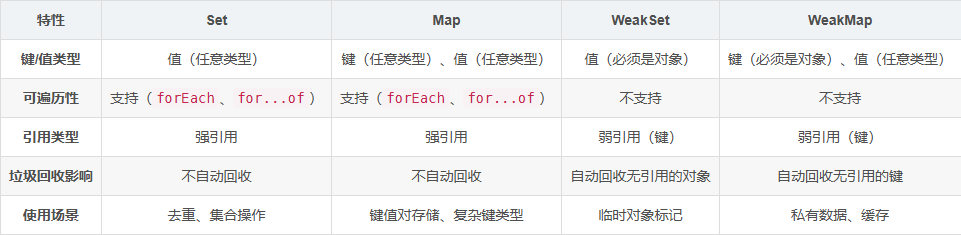

## 判断属性是否存在

1. in操作符
`in` 操作符可以检查对象自身及其原型链中是否具有指定的属性。
    ```js
    const o = {
      a: 1,
      b: 2
    }
    // 在Object原型上添加属性d
    Object.prototype.d = 4
    Object.defineProperty(Object.prototype, 'e', {
      value: 5,
      enumerable: false
    })

    Object.defineProperty(o, 'c', {
      value: 3,
      enumerable: false
    })

    console.log('a' in o) // true
    console.log('c' in o) // true
    console.log('d' in o) // true
    console.log('e' in o) // true
    ```

2. hasOwnProperty
`hasOwnProperty` 方法检查属性是否为对象自身的属性，而不是继承的,不关心属性是否可枚举

    ```js
      const o = {
        a: 1,
        b: 2
      }
      // 在Object原型上添加属性d
      Object.prototype.d = 4
      Object.defineProperty(o, 'c', {
        value: 3,
        enumerable: false
      })

      console.log(o.hasOwnProperty('a')) // true
      console.log(o.hasOwnProperty('c')) // true
      console.log(o.hasOwnProperty('d')) // false
    ```
3. Object.getOwnPropertyNames
`Object.getOwnPropertyNames` 获取对象自身所有属性名，不关心是否可枚举
```js
const o = {
  a: 1,
  b: 2
}
// 在Object原型上添加属性d
Object.prototype.d = 4
Object.defineProperty(Object.prototype, 'e', {
  value: 5,
  enumerable: false
})

Object.defineProperty(o, 'c', {
  value: 3,
  enumerable: false
})
console.log(Object.getOwnPropertyNames(o).includes('a')) // true
console.log(Object.getOwnPropertyNames(o).includes('c')) // true
console.log(Object.getOwnPropertyNames(o).includes('d')) // false
console.log(Object.getOwnPropertyNames(o).includes('e')) // false
```

4. Object.keys
`Object.keys` 方法只能遍历自身可枚举属性
    ```js
    const o = {
      a: 1,
      b: 2
    }
    // 在Object原型上添加属性d
    Object.prototype.d = 4
    Object.defineProperty(o, 'c', {
      value: 3,
      enumerable: false
    })

    console.log(Object.keys(o)) // [ 'a', 'b' ]
    console.log(Object.keys(o).includes('a')) // true
    console.log(Object.keys(o).includes('c')) // false
    console.log(Object.keys(o).includes('d')) // false
    ```

5. Object.prototype.propertyIsEnumerable
`propertyIsEnumerable` 方法检查指定的属性是否可以通过 for...in 循环被枚举。这对于检查对象自身的可枚举属性是否具有某个属性很有用
Object.prototype.propertyIsEnumerable 方法是用来检查对象自身属性是否可以被枚举的。这意味着，如果一个属性可以被循环遍历（例如，通过 for...in 循环），则该方法返回 true；否则返回 false。
  ```js
  const o = {
    a: 1,
    b: 2
  }
  // 在Object原型上添加属性d
  Object.prototype.d = 4
  Object.defineProperty(Object.prototype, 'e', {
    value: 5,
    enumerable: false
  })

  Object.defineProperty(o, 'c', {
    value: 3,
    enumerable: false
  })

  console.log(o.propertyIsEnumerable('a')) // true
  console.log(o.propertyIsEnumerable('c')) // false
  console.log(o.propertyIsEnumerable('d')) // false
  console.log(o.propertyIsEnumerable('e')) // false
  ```

  总结
  -  in 检查自身以及原型上的属性
  - Object.prototype.hasOwnProperty 和 Object.getOwnPropertyNames 检查自身属性，不关心是否可被枚举
  - Object.keys 和 Object.prototype.propertyIsEnumerable 仅仅检查自身可被枚举的属性


## Set WeakSet Map WeakMap



常见问题
1. Set 和数组有何区别？
Set 自动去重且无序（按插入顺序存储），数组允许重复且有序。

2. Map 和普通对象有何区别？
Map 的键可以是任意类型，普通对象的键只能是字符串或 Symbol。

3. WeakSet/WeakMap 为什么不能遍历？
弱引用设计导致无法保证元素稳定性，垃圾回收可能随时移除元素。

4. 如何选择 Set 和 WeakSet？
若需长期持有对象引用，使用 Set；若需自动管理对象生命周期，使用 WeakSet。

