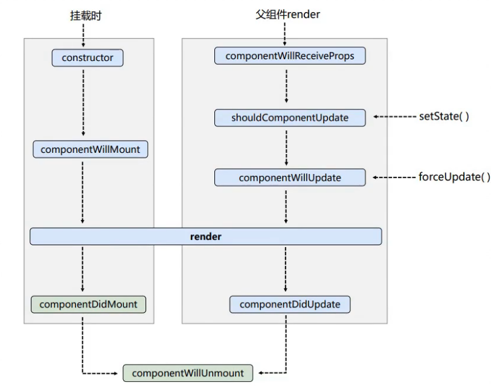
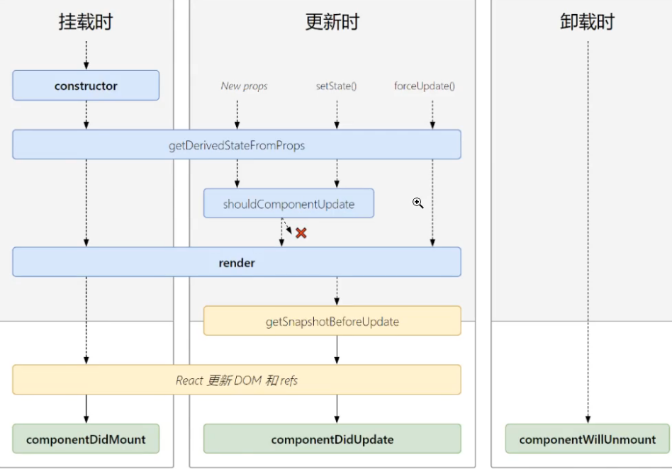

# React基础

## 2.react定义组件的方法有哪些？区别是什么？
1. 函数式组件
2. es5方式`React.createClass`组件 
3. es6方式`extends React.Component`

注意: React.createClass 在16.0以后的版本中被废弃

区别： 

## 2.props为什么是只读的

React对props做过冻结处理Object.freeze(props)

## 3.为函数组件为props设置默认值,属性校验

```js
const Demo = function (props){
  let {title,x} = props

  return <div></div>
}

Demo.defaultProps = {
  x:0
}
import PropTypes from 'prop-types'
Demo.propTypes = {
  title:PropTypes.string.isRequired
}

```

## 4.setState到底是异步还是同步?

1. setState只在合成事件和钩子函数中是“异步”的，在原生事件和setTimeout 中都是同步的。
2. setState 的“异步”并不是说内部由异步代码实现，其实本身执行的过程和代码都是同步的，<font color="red">只是合成事件和钩子函数的调用顺序在更新之前，导致在合成事件和钩子函数中没法立马拿到更新后的值</font>，形成了所谓的“异步”，当然可以通过第二个参数 setState(partialState, callback) 中的callback拿到更新后的结果。
3. setState 的批量更新优化也是建立在“异步”（合成事件、钩子函数）之上的，在原生事件和setTimeout 中不会批量更新，在“异步”中如果对同一个值进行多次setState，setState的批量更新策略会对其进行覆盖，取最后一次的执行，如果是同时setState多个不同的值，在更新时会对其进行合并批量更新。

## 5.react17前后版本生命周期的差异
17版本之前的生命周期


17及以后的新生命周期


在react 18版本中
废弃的生命周期
- componentWillMount
- componentWillReceiveProps
- componentWillUpdate
  并改名为 UNSAFE_componentWillMount、UNSAFE_componentWillReceiveProps、UNSAFE_componentWillUpdate