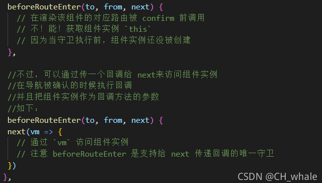
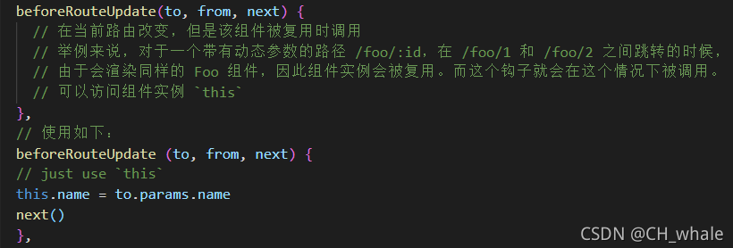
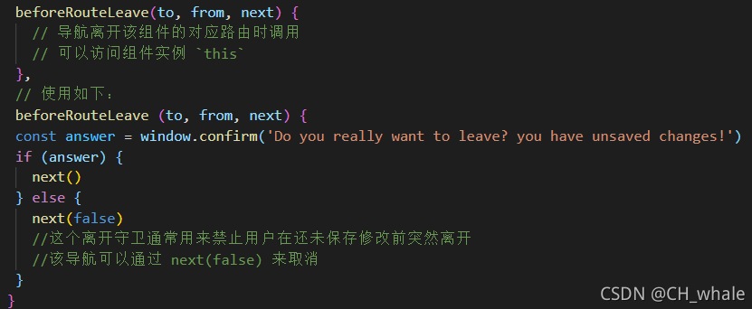

# Vue考点汇总

## 1. 有使用过vue吗？说说你对vue的理解

Vue 是一个构建数据驱动的 Web 界面的渐进式框架。 Vue 的目标是通过尽可能简单的 API 实现响应的数据绑定和组合的视图组件。核心是一个响应的数据绑定系统。

优点有：轻量（大小只有十几k），简单易学；实现双向数据绑定和组件化；视图、数据、结构分离，是数据更改更简单；使用虚拟DOM，减少了dom操作；运行速度快；

缺点：不支持IE8及以下、是SPA，对SEO不友好

## 2. 什么是虚拟DOM？

虚拟DOM：是使用JS对象来模拟DOM树。页面的更新可以先全部反应在JS对象（虚拟DOM）上（使用DIff算法），操作内存中的JS对象的速度显然更快，等更新完成后，再将最终的JS对象映射成真实的DOM，交由浏览器去绘制。

虚拟DOM比原生dom更快吗？

至于很多人说虚拟dom操作会比原生dom更快，也不全面。比如，首次渲染或者所有节点都需要进行更新的时候，这个时候采用虚拟dom会比直接操作原生dom多一重构建虚拟dom的动作，会占用更多的内存以及延长渲染时间。

虚拟dom的存在，并不是免费的，对比新旧虚拟dom树的差异会带来一定的性能开销。

虚拟dom的优势在于我们更新节点的时候，它会检查哪些节点需要更新。尽量复用已有dom，减少dom的删除和创建。并且这些操作我们是可以通过手动操作js底层api实现的。只是我们手动操作会比较费时，这个工作由虚拟dom代劳会让我们开发更快速便捷。

## 3. 说说你对选项el,template,render的理解

1. el：提供一个在页面上已存在的DOM元素作为Vue实例的挂载目标。只在用new 创建实例时生效，组件对象中不能使用

2. template：一个字符串模板作为Vue实例的标识使用。模板将会替换挂载元素。挂载元素的内容将会被忽略，除非模板的内容由分发插槽。

    可以是id选择器、普通的html元素字符串、注册好的组件

    new 创建实例以及组件对象中均能使用
3. render函数：可以渲染组件对象、普通元素名

4. 显示权重：reader > remplate > el

## 4. 为什么说基于Proxy的响应式实现，性能整体优于Object.defineProperty

proxy是对整个对象进行代理，所以可以监听对象某个属性值的变化，还可以监听对象属性的新增和删除，而且还可以监听数组；而 defineProperty 只是给对象的某个已存在的属性添加对应的 getter 和 setter，所以它只能监听这个属性值的变化，而不能去监听对象属性的新增和删除。

## 5. Vue2.0和Vue3.0的生命周期有什么区别

### vue2常用生命周期

创建前：beforeCreate() 只有一些实例本身的事件和生命周期函数

创建后：Created() 是最早使用data和methods中数据的钩子函数

挂载前：beforeMount() 指令已经解析完毕，内存中已经生成dom树

挂载后：Mounted() dom渲染完毕页面和内存的数据已经同步

更新前：beforeUptate() 当data的数据发生改变会执行这个钩子，内存中的数据是新的，页面是旧的

更新后：Updated() 内存和页面都是新的

销毁前：beforeDestroy() 即将销毁data和methods中的数据此时还是可以使用的，可以做一些释放内存的操作

销毁后：Destroyed() 已经销毁完毕

### vue3生命周期做出了一些改动

前面的是vue2的后面是vue3

beforeCreate  -> setup() 开始创建组件之前，创建的是data和method

created       -> setup()

beforeMount   -> onBeforeMount 组件挂载到节点上之前执行的函数。

mounted       -> onMounted 组件挂载完成后执行的函数

beforeUpdate  -> onBeforeUpdate 组件更新之前执行的函数。

updated       -> onUpdated 组件更新完成之后执行的函数。

beforeDestroy -> onBeforeUnmount 组件挂载到节点上之前执行的函数。

destroyed     -> onUnmounted 组件卸载之前执行的函数。

### 多组件（父子组件）中生命周期的调用顺序说一下

组件的调用顺序都是先父后子，渲染完成的顺序是先子后父。组件的销毁操作是先父后子，销毁完成的顺序是先子后父。

1. 加载渲染过程：父beforeCreate->父created->父beforeMount->子beforeCreate->子created->子beforeMount- >子mounted->父mounted
2. 子组件更新过程：父beforeUpdate->子beforeUpdate->子updated->父updated
3. 父组件更新过程：父 beforeUpdate -> 父 updated
4. 销毁过程：父beforeDestroy->子beforeDestroy->子destroyed->父destroyed


## 6. 使用Vue2写的项目如何升级为Vue3？需要考虑哪些因素？

Vue3不支持IE11

## 7. Vue2和Vue3数据双向绑定的原理及区别

vue2
采用数据劫持结合发布订阅模式（PubSub 模式）的方式，通过 Object.defineProperty 来劫持各个属性的 setter、getter，在数据变动时发布消息给订阅者，触发相应的监听回调。

```html
1.实现一个监听器Observer，用来劫持并监听所有属性，如果有变动的，就通知订阅者。

2.实现一个订阅者Watcher，可以收到属性的变化通知并执行相应的函数，从而更新视图。

3.实现一个解析器Compile，可以扫描和解析每个节点的相关指令，并根据初始化模板数据以及初始化相应的订阅器。
```

Vue3
通过Proxy代理拦截对data任意属性的操作(13种),包括对属性值的读写，添加，删除等等...
通过Reflet动态对代理对象相应属性进行相应的操作。


## 8. Vue2 数据定义不在data里有什么问题，有什么解决方案

不在data里，属性就不是响应式的，可以用Vue.set(target,key,val)或 this.$.set() 将属性转换成响应式的

## 9. Vue2是如何监测数组数据的变化

Vue2.x 中实现检测数组变化的方法，是将数组的常用方法(push,pop,shift,unshift,splice,sort,reverse)进行了重写。Vue 将 data 中的数组进行了原型链重写，指向了自己定义的数组原型方法。这样当调用数组 api 时，可以通知依赖更新。如果数组中包含着引用类型，会对数组中的引用类型再次递归遍历进行监控。这样就实现了监测数组变化。
流程:

1. 初始化传入 data 数据执行 initData
2. 将数据进行观测 new Observer
3. 将数组原型方法指向重写的原型
4. 深度观察数组中的引用类型

有两种情况无法检测到数组的变化。

1. 当利用索引直接设置一个数组项时，例如 vm.items[indexOfItem] = newValue
2. 当修改数组的长度时，例如 vm.items.length = newLength

不过这两种场景都有对应的解决方案。

利用索引设置数组项的替代方案

```js
//使用该方法进行更新视图
// vm.$set，Vue.set的一个别名
vm.$set(vm.items, indexOfItem, newValue)
```

修改数组的长度的替代方案

```js
//使用该方法进行更新视图
// Array.prototype.splice
vm.items.splice(indexOfItem, 1, newValue)
```


## 10. Vue3组件通信方式

方式一：props / $emit
props父组件传递数据给子组件
emit子组件以方发派发的方式触发

方式二：expose / ref
父组件获取子组件的属性或者调用子组件方法

```js
// Child.vue
<script setup>
    // 方法一 不适用于Vue3.2版本，该版本 useContext()已废弃
    import { useContext } from "vue"
    const ctx = useContext()
    // 对外暴露属性方法等都可以
    ctx.expose({
        childName: "这是子组件的属性",
        someMethod(){
            console.log("这是子组件的方法")
        }
    })
    
    // 方法二 适用于Vue3.2版本, 不需要引入
    // import { defineExpose } from "vue"
    defineExpose({
        childName: "这是子组件的属性",
        someMethod(){
            console.log("这是子组件的方法")
        }
    })
</script>

// Parent.vue  注意 ref="comp"
<template>
    <child ref="comp"></child>
    <button @click="handlerClick">按钮</button>
</template>
<script setup>
    import child from "./child.vue"
    import { ref } from "vue"
    const comp = ref(null)
    const handlerClick = () => {
        console.log(comp.value.childName) // 获取子组件对外暴露的属性
        comp.value.someMethod() // 调用子组件对外暴露的方法
    }
</script>

```
  
方式四：attrs
attrs：包含父作用域里除 class 和 style 除外的非 props 属性集合

```js
// Parent.vue 传送
<child :msg1="msg1" :msg2="msg2" title="3333"></child>
<script setup>
    import child from "./child.vue"
    import { ref, reactive } from "vue"
    const msg1 = ref("1111")
    const msg2 = ref("2222")
</script>

// Child.vue 接收
<script setup>
    import { defineProps, useContext, useAttrs } from "vue"
    // 3.2版本不需要引入 defineProps，直接用
    const props = defineProps({
        msg1: String
    })
    // 方法一 不适用于 Vue3.2版本，该版本 useContext()已废弃
    const ctx = useContext()
    // 如果没有用 props 接收 msg1 的话就是 { msg1: "1111", msg2:"2222", title: "3333" }
    console.log(ctx.attrs) // { msg2:"2222", title: "3333" }
    
    // 方法二 适用于 Vue3.2版本
    const attrs = useAttrs()
    console.log(attrs) // { msg2:"2222", title: "3333" }
</script>

```

方式五：provide / inject 为依赖注入

provide：可以让我们指定想要提供给后代组件的数据或
inject：在任何后代组件中接收想要添加在这个组件上的数据，不管组件嵌套多深都可以直接拿来用

```js
// Parent.vue
<script setup>
    import { provide } from "vue"
    provide("name", "沐华")
</script>

// Child.vue
<script setup>
    import { inject } from "vue"
    const name = inject("name")
    console.log(name) // 沐华
</script>
```

方式六： mitt.js
Vue3 中没有了 EventBus 跨组件通信，但是现在有了一个替代的方案 mitt.js，原理还是 EventBus

## 11. Vue2组件通信方式

- 父子组件通信: props; $parent / $children; provide / inject ; ref ;  $attrs / $listeners
- 兄弟组件通信: eventBus ;  vuex
- 跨级通信:  eventBus；Vuex；provide / inject 、$attrs / $listeners

## 12. 说说你对指令的理解

指令 (Directives) 是带有 v- 前缀的特殊 attribute。指令 attribute 的值预期是单个 JavaScript 表达式 (v-for 是例外情况，稍后我们再讨论)。指令的职责是，当表达式的值改变时，将其产生的连带影响，响应式地作用于 DOM。


## 13. 自定义指令的生命周期（钩子函数）有哪些

- bind：只调用一次，指令第一次绑定到元素时调用。在这里可以进行一次性的初始化设置。

- inserted：被绑定元素插入父节点时调用 (仅保证父节点存在，但不一定已被插入文档中)。

- update：所在组件的 VNode 更新时调用，但是可能发生在其子 VNode 更新之前。指令的值可能发生了改变，也可能没有。但是你可以通过比较更新前后的值来忽略不必要的模板更新 (详细的钩子函数参数见下)。

- componentUpdated：指令所在组件的 VNode 及其子 VNode 全部更新后调用。

- unbind：只调用一次，指令与元素解绑时调用。

## 14. 说说你对keep-alive的理解是什么？

keep-alive 是 Vue 内置的一个组件，可以使被包含的组件保留状态，避免重新渲染 ，其有以下特性：

- 一般结合路由和动态组件一起使用，用于缓存组件；
- 提供 include 和 exclude 属性，两者都支持字符串或正则表达式， include 表示只有名称匹配的组件会被缓存，exclude 表示任何名称匹配的组件都不会被缓存 ，其中 exclude 的优先级比 include 高；
- 对应两个钩子函数 activated 和 deactivated ，当组件被激活时，触发钩子函数 activated，当组件被移除时，触发钩子函数 deactivated。

## 15. 计算属性和监听属性的区别

vue 2.x：

computed（计算属性）：

1. 监听值未在data中定义，以return返回值形式；
2. 计算属性的值会被缓存，只有实例中相关依赖值改变时，才重新计算，性能好但不适合做异步请求；
3. 计算属性默认只有get来读取，手动修改计算属性时，会触发手写的set函数。

watch (监听器）：

1. 监听值要在data中先定义，可以不写return返回值；
2. 不支持缓存，可以做异步操作；
3. 监听值改变，回调函数自动调用。

vue 3.x：

computed（计算属性）：

以函数返回的形式定义，接受一个getter函数，并根据getter的返回值返回一个不可变的响应式ref对象

```js
const count = ref(0)
const add = computed(() => count.value++)
```

手动修改计算属性的值，回出发手写的set函数

```js
const count = ref(1)
const plusOne = computed({
    get: () => count.value + 1,
    set: val => {
        count.value = val - 1
    }
})

plusOne.value = 1
console.log(plusOne.value) // 0
```

watch(监听器）：
监听器封装成了函数，数据源可以是一个具有返回值的getter函数，也可以是一个ref

```js
const state = reactive({count:0})
watch(
    () => state.count,
    (count,prevCount) => {
        /**  TODO */
    }
)

const count = ref(0)
watch(count,(count,prevCount) => {
    /** TODO */
})

```

可以同时监听多数据源

```js
watch(
    [fooRef,barREf],
    ([foo,bar],[prevFoo,prevBar]) => {
        /**  */
    }
)

```

## 16. vue3 watch和watchEffet的区别

watch:
避坑：

- watch监视ref定义的数据可以正确获取oldValue,watch监视reative定义的对象数据，oldValue不准确
- watch监视的是reactive定义的整个对象数据时，deep配置失效，强制开启深度监视，深度监视关闭不了。监视的是reactive定义的对象某个属性时，deep配置生效，如果监视的层级较深，需要手动开启deep:true

- 需要指定监听源
- 默认不执行回调，通过配置{immediate:true}初始化时立即执行一次回调
- 配置{deep:true} 指定深度监视

watchEffet：

- 不需要指定监听源
- 默认初始化时会立即执行一次回调

## 17. v-if 和 v-for 的优先级是什么？

在Vue2中：v-for优先级比v-if高，Vue3 中：v-if优先级比v-for高。

注意事项：

1. 永远不要把 v-if 和 v-for 同时用在同一个元素上
2. 如果避免出现这种情况，则在外层嵌套template（页面渲染不生成dom节点），在这一层进行 v-if 判断，然后在内部进行 v-for 循环

```vue
<template v-if="isShow">
    <p v-for="item in items">
</template>
```

3. 如果条件出现在循环内部，可通过计算属性computed提前过滤掉那些不需要显示的项

```vue
computed: {
    items: function() {
      return this.list.filter(function (item) {
        return item.isShow
      })
    }
}
```

## 18. 删除数组用delete和Vue.delete有什么区别？

- delete：只是被删除数组成员变为 empty / undefined，其他元素键值不变
- Vue.delete：直接删了数组成员，并改变了数组的键值（对象是响应式的，确保删除能触发更新视图，这个方法主要用于避开 Vue 不能检测到属性被删除的限制）

## 19. 说说你对vue的mixin的理解，有什么应用场景？

多个实例引用了相同或相似的方法或属性等，可将这些重复的内容抽取出来作为mixins的js，export出去，在需要引用的vue文件通过mixins属性注入，与当前实例的其他内容进行merge。
一个混入对象可以包含任意组件选项。同一个生命周期，混入对象会比组件的先执行。

## 20. 怎么捕获组件vue的错误信息？

1. errorCaptured 钩子可以捕获组件内部错误 
   errorCaptured 是组件内部钩子，当捕获一个来自子孙组件的错误时被调用，接收 error、 vm、info 三个参数，return false 后可以阻止错误继续向上抛出

```vue
export default{
  data(){},
  methods:{},
  created(){},
  mounted(){},
  /**
   * 收到三个参数：
   * 错误对象、发生错误的组件实例
   * 以及一个包含错误来源信息的字符串。
   * 此钩子可以返回 false 以阻止该错误继续向上传播。
   */
  errorCaptured(err, vm, info){
    console.log(err)
    // -> 错误返回
    console.log(vm)
    // -> vue实例
    console.log(info)
    // -> 在哪个钩子发生错误
    return false
  }
}
```

2. errorHandler 全局错误捕获
errorHandler 为全局钩子，使用 Vue.config.errorHandler 配置，接收参数与 errorCaptured 一 致，2.6 后可捕捉 v-on 与 promise 链的错误，可用于统一错误处理与错误兜底

```vue
/** * 收到三个参数： 
    * 错误对象、发生错误的组件实例 
    * 以及一个包含错误来源信息的字符串。
    */
Vue.config.errorHandler = function (err, vm, info) {
    
}
```

## 21. SPA首屏加载速度慢的怎么解决？

（1）较少入口文件体积：如路由懒加载

（2）静态资源本地缓存：如采用http缓存、localStorage等

（3）UI框架按需加载

（4）避免重复组件多次下载：修改webpack配置

（5）图片资源压缩

（6）开启Gzip压缩

（7）使用服务器端渲染（SSR）

## 22. 说说你对vue的extend（构造器）的理解，它主要是用来做什么的？

 (1) Vue.extend(option)：使用基础Vue构造器，创建一个“子类”。参数是一个包含组件选项的 对象

（2）extends：允许声明扩展另一个组件（可以是一个简单的选项对象或构造函数），而无需使用Vue.extend。主要是为了便于扩展单文件组件

## 23. 页面刷新后vuex的state数据丢失怎么解决？

- 一般结合localStorage来做数据的备份

- 借助辅助插件vuex-persistedstate

## 24. vue-router钩子函数有哪些？都有哪些参数？

1）全局守卫：beforeEach()、beforeResolve()、afterEach()

```vue
const router = new VueRouter({...})

router.beforeEach((to, from, next) => { // 全局前置守卫
 /* 必须调用next */
})

router.beforeResolve((to, from, next) =>{ // 全局解析守卫
 /* 必须调用next */
})

router.afterEach((to, from) => {}) // 全局后置钩子

```

（2）路由独享守卫

```vue
const router = new VueRouter({
 routes: [{
  path: '/home',
  component: Home,
  beforeEnter: (to, from, next) => {
   // ...
  }
 }]
})

```

3）组件内的守卫：beforeRouteEnter()、beforeRouteUpdate()、beforeRouteLeave()

```vue
const Foo = {
 template: `...`,
 beforeRouteEnter(to, from, next) {
  next(vm => {
   // 通过`vm`访问组件实例，this不可用
  })
 },
 beforeRouteUpdate(to, from, next) {
  this.name = to.params.name
  next()
 },
 beforeRouteLeave(to, from, next) {
  const answer = window.confirm('Do you really want to leave?')
  if (answer) {
   next()
  } else {
   next(false)
  }
 }
}

```

（4）完整的导航解析流程

1. 导航被触发
2. 在失活的组件里调用beforeRouteLeave()守卫
3. 调用全局的beforeEach()守卫
4. 在重用组件里调用beforeRouteUpdate()守卫
5. 在路由配置里调用beforeEnter()
6. 解析异步路由组件
7. 在被激活的组件里调用beforeRouteEnter()
8. 调用全局的beforeResolve()守卫
9. 导航被确认
10. 调用全局的afterEach钩子
11. 触发DOM更新
12. 调用beforeRouteEnter守卫中传给next的回调函数，创建好的组件实例会作为回调函数的参数传入

## 25. 怎么实现路由懒加载呢？

```vue
const router = new VueRouter({
  routes: [{ path: '/foo', component: () => import('./Foo.vue') }]
})
```

## 26. vue-router如何响应路由参数的变化？

1）为什么要响应参数变化

- 切换路由，参数发生了变化，但页面数据并未及时更新，需要强制刷新后才会变化
- 不同路由渲染相同的组件时（组件复用比销毁再创建效率高），切换路由后，当前组件的生命周期函数不在被调用

2）方法：

- 使用watch监听
  
```vue
watch: {
    $route(to, from){
        if(to != from) {
            console.log("监听到路由变化，做出相应的处理");
        }
    }
}
```

- 向router-view组件中添加key
  
```vue
<router-view :key="$route.fullPath"></router-view>
```

## 27. 切换到新路由时，页面要滚动到顶部或保持原先的滚动位置怎么做呢？

```vue
const router = new VueRouter({
  routes: [...],
  scrollBehavior (to, from, savedPosition) {
    if (savedPosition) {
     return savedPosition // 保持原滚动位置
   } else {
     return { x: 0, y: 0 } // 滚动到顶部
   }

   // if (to.hash) {
   //   return {
   //     selector: to.hash // 滚动到锚点
   //     behavior: 'smooth', // 平滑滚动
   //   }
   // }

   // return new Promise((resolve, reject) => { // 异步滚动
   //   setTimeout(() => {
   //     resolve({ x: 0, y: 0 })
   //   }, 500)
   // })
  }
})
```

## 28. route和router有什么区别？

- route：表示当前的路由信息，包含了当前URL解析得到的信息，如当前的路径、参数、query对象等

- router：是全局路由的实例，是Router构造方法的实例。包含了所有路由的属性和方法

## 29. 怎么监听vuex数据的变化？

- 在vue文件中：通过计算属性获取vuex中的数据，再通过watch来监听计算属性中的值

- 在非vue文件中：使用vuex的实例方法watch来监听

## 30. 有用过vuex吗？它主要解决的是什么问题？推荐在哪些场景用？

1）Vuex是一个专为Vue.js应用程序开发的状态管理模式。它采用集中式存储管理应用的所有组件的状态，并以相应的规则保证状态以一种可预测的方式发生变化。

（2）应用场景：

- 多个视图依赖同一状态
- 来自不同视图的行为需要变更同一状态
- 大型单页应用
  
（3）优势

- 全局变量状态的同一管理，便于代码的维护
- 单向数据流，使状态的变化可追踪、可预测
- 实现各个组件的自由传参

## 31. 你认为vue的核心是什么？

数据驱动和组件系统


## 32. 你了解什么是高阶组件吗？可否举个例子说明下？

所谓高阶组件其实就是一个高阶函数, 即返回一个组件函数的函数，Vue中怎么实现呢？ 注意 高阶组件有如下特点

- 高阶组件(HOC)应该是无副作用的纯函数，且不应该修改原组件,即原组件不能有变动
- 高阶组件(HOC)不关心你传递的数据(props)是什么，并且新生成组件不关心数据来源
- 高阶组件(HOC)接收到的 props 应该透传给被包装组件即直接将原组件prop传给包装组件
- 高阶组件完全可以添加、删除、修改 props


Base.vue

```vue
<template>
  <div>
    <p @click="Click">props: {{test}}</p>
  </div>
</template>
<script>
export default {
  name: 'Base',
  props: {
    test: Number
  },
  methods: {
    Click () {
      this.$emit('Base-click')
    }
  }
}
</script>
```

[高阶组件](https://blog.csdn.net/z609373067/article/details/81258966)

```vue
function Console (Base) {
  return {
    mounted () {
      console.log('haha')
    },
    props: Base.props,
    render (h) {
      const slots = Object.keys(this.$slots)
        .reduce((arr, key) => arr.concat(this.$slots[key]), [])
        // 手动更正 context
        .map(vnode => {
          vnode.context = this._self //绑定到高阶组件上
          return vnode
        })
 
      return h(WrappedComponent, {
        on: this.$listeners,
        props: this.$props,
        attrs: this.$attrs
      }, slots)
    }
  }
}
```

## 33.  怎么缓存当前的组件？缓存后怎么更新？

开发中缓存组件使用keep-alive组件，keep-alive是vue内置组件，keep-alive包裹动态组件component时，会缓存不活动的组件实例，而不是销毁它们，这样在组件切换过程中将状态保留在内存中，防止重复渲染DOM。

```vue
<keep-alive>
  <component :is="view"></component>
</keep-alive>
```

结合属性include和exclude可以明确指定缓存哪些组件或排除缓存指定组件,<font color="red">**include和exclude匹配的是组件的name属性，所以要给所有的路由组件赋值name属性**</font>

vue3中结合vue-router时变化较大，之前是keep-alive包裹router-view，现在需要反过来用router-view包裹keep-alive：

```vue
<router-view v-slot="{ Component }">
  <transition>
    <keep-alive>
      <component :is="Component" />
    </keep-alive>
  </transition>
</router-view>

```

缓存后如果要获取数据，解决方案可以有以下两种：

```
1.beforeRouteEnter：在有vue-router的项目，每次进入路由的时候，都会执行beforeRouteEnter

 beforeRouteEnter(to, from, next){
  next(vm=>{
    console.log(vm)
    // 每次进入路由执行
    vm.getData()  // 获取数据
  })
},

2.activated：在keep-alive缓存的组件被激活的时候，都会执行activated钩子

activated(){
  this.getData() // 获取数据
},
```

## 34.  vue要做权限管理该怎么做？如果控制到按钮级别的权限怎么做？

人员 - 角色 - 权限（菜单、按钮）

封装了一个指令权限，能简单快速的实现按钮级别的权限判断。

使用权限字符串 v-hasPermi

```vue
// 单个
<el-button v-hasPermi="['system:user:add']">存在权限字符串才能看到</el-button>
// 多个
<el-button v-hasPermi="['system:user:add', 'system:user:edit']">包含权限字符串才能看到</el-button>
```

使用角色字符串 v-hasRole

```vue
// 单个
<el-button v-hasRole="['admin']">管理员才能看到</el-button>
// 多个
<el-button v-hasRole="['role1', 'role2']">包含角色才能看到</el-button>

```

在某些情况下，它是不适合使用v-hasPermi，如元素标签组件，只能通过手动设置v-if。 可以使用全局权限判断函数，用法和指令 v-hasPermi 类似。

```vue
<template>
  <el-tabs>
    <el-tab-pane v-if="checkPermi(['system:user:add'])" label="用户管理" name="user">用户管理</el-tab-pane>
    <el-tab-pane v-if="checkPermi(['system:user:add', 'system:user:edit'])" label="参数管理" name="menu">参数管理</el-tab-pane>
    <el-tab-pane v-if="checkRole(['admin'])" label="角色管理" name="role">角色管理</el-tab-pane>
    <el-tab-pane v-if="checkRole(['admin','common'])" label="定时任务" name="job">定时任务</el-tab-pane>
   </el-tabs>
</template>

<script>
import { checkPermi, checkRole } from "@/utils/permission"; // 权限判断函数

export default{
   methods: {
    checkPermi,
    checkRole
  }
}
</script>

```

v-hasPermi

```vue
 /**
 * v-hasPermi 操作权限处理
 * Copyright (c) 2019 ruoyi
 */
 
import store from '@/store'

export default {
  mounted(el, binding, vnode) {
    const { value } = binding
    const all_permission = "*:*:*";
    const permissions = store.getters && store.getters.permissions

    if (value && value instanceof Array && value.length > 0) {
      const permissionFlag = value

      const hasPermissions = permissions.some(permission => {
        return all_permission === permission || permissionFlag.includes(permission)
      })

      if (!hasPermissions) {
        el.parentNode && el.parentNode.removeChild(el)
      }
    } else {
      throw new Error(`请设置操作权限标签值`)
    }
  }
}
```
v-hasRole

```
 /**
 * v-hasRole 角色权限处理
 * Copyright (c) 2019 ruoyi
 */
 
import store from '@/store'

export default {
  mounted(el, binding, vnode) {
    const { value } = binding
    const super_admin = "admin";
    const roles = store.getters && store.getters.roles

    if (value && value instanceof Array && value.length > 0) {
      const roleFlag = value

      const hasRole = roles.some(role => {
        return super_admin === role || roleFlag.includes(role)
      })

      if (!hasRole) {
        el.parentNode && el.parentNode.removeChild(el)
      }
    } else {
      throw new Error(`请设置角色权限标签值"`)
    }
  }
}
```

```
import hasRole from './permission/hasRole'
import hasPermi from './permission/hasPermi'

export default function directive(app){
  app.directive('hasRole', hasRole)
  app.directive('hasPermi', hasPermi)
}
```

v-if 工具方法判断  

```vue
import store from '@/store'

/**
 * 字符权限校验
 * @param {Array} value 校验值
 * @returns {Boolean}
 */
export function checkPermi(value) {
  if (value && value instanceof Array && value.length > 0) {
    const permissions = store.getters && store.getters.permissions
    const permissionDatas = value
    const all_permission = "*:*:*";

    const hasPermission = permissions.some(permission => {
      return all_permission === permission || permissionDatas.includes(permission)
    })

    if (!hasPermission) {
      return false
    }
    return true
  } else {
    console.error(`need roles! Like checkPermi="['system:user:add','system:user:edit']"`)
    return false
  }
}

/**
 * 角色权限校验
 * @param {Array} value 校验值
 * @returns {Boolean}
 */
export function checkRole(value) {
  if (value && value instanceof Array && value.length > 0) {
    const roles = store.getters && store.getters.roles
    const permissionRoles = value
    const super_admin = "admin";

    const hasRole = roles.some(role => {
      return super_admin === role || permissionRoles.includes(role)
    })

    if (!hasRole) {
      return false
    }
    return true
  } else {
    console.error(`need roles! Like checkRole="['admin','editor']"`)
    return false
  }
}
```

## 35. vuex的action和mutation的特性是什么？有什么区别？

Action

一些对 State 的异步操作可放在 Action 中，并通过在 Action 中 commit Mutation 变更状态。Action 可通过 store.dispatch() 方法触发，或者通过 mapActions 辅助函数将 vue 组件的 methods 映射成 store.dispatch() 调用。

Mutation

在 vuex 的严格模式下，Mutaion 是 vuex 中改变 State 的唯一途径，Mutation 中只能是同步操作通过 store.commit() 调用 Mutation

## 36. 怎么监听vuex数据的变化？

- 可以通过watch选项或者watch方法监听状态；
- 可以使用vuex提供的API：store.subscribe()；

- watch选项方式，可以以字符串形式监听$store.state.xx；subscribe方式，可以调用store.subscribe(cb)，回调函数接收mutation对象和state对象，这样可以进一步判断mutation.type是否是期待的那个，从而进一步做后续处理；
- 总的来说，watch方式简单好用，且能获取变化前后值，首选；subscribe方法会被所有commit行为触发，因此还需要判断mutation.type，用起来略繁琐，一般用于vuex插件中；

```vue
//Vue2
watch: {
  "$store.state.test.count": {
    immediate: true,
    handler(val) {
      console.log(val)
    }
  }
}
//Vue3
const store = useStore()

watch(
  store.state,
  (val) => {
    console.log(val.count)
  },
  { immediate: true }
)
//store.subscribe
mounted() {
  this.$store.subscribe((mutation, state) => {
    if (mutation.type == "test/INCREMENT") {
      console.log(state.test.count)
    }
  })
}
```

## 37.  vuex怎么知道state是通过mutation修改还是外部直接修改的？ 

Vuex 中修改 state 的唯一渠道就是执行 commit(‘xx’, payload) 方法，其底层通过执行 this._withCommit(fn) 设置_committing 标志变量为 true，然后才能修改 state，修改完毕还需要还原_committing 变量。外部修改虽然能够直接修改 state，但是并没有修改_committing 标志位，所以只要 watch 一下 state，state change 时判断是否_committing 值为 true，即可判断修改的合法性。

## 38.  在vue事件中传入$event，使用e.target和e.currentTarget有什么区别？

event.currentTarget指向事件所绑定的元素，而event.target始终指向事件触发的元素。

## 39. vue怎么实现强制刷新组件？

1. 如果要在组件内部中进行强制刷新
  
    调用this.$forceUpdate()强制重新渲染组件

1. 如果是刷新某个子组件
  
    利用v-if指令的特性。

    当组件的key 值变更时，会自动的重新渲染

## 40. Vue实例初始化时，data、props、methods顺序

```js
function initState (vm) {
    vm._watchers = [];
    var opts = vm.$options;
    if (opts.props) { initProps(vm, opts.props); }
    if (opts.methods) { initMethods(vm, opts.methods); }
    if (opts.data) {
      initData(vm);
    } else {
      observe(vm._data = {}, true /* asRootData */);
    }
    if (opts.computed) { initComputed(vm, opts.computed); }
    if (opts.watch && opts.watch !== nativeWatch) {
      initWatch(vm, opts.watch);
    }
  }
```
以上为vue的部分源码，可以看出判断顺序：
props > methods > data > computed > watch
因此如果有同名属性或方法，会被覆盖

## 42. 什么是MVVM,MVC 它们又有什么区别？

### MVVM

mvvm是model--view--viewmodel的简写，即模型-视图-视图模型。

M：model，模型层。代表渲染页面所依赖的数据源，是通过Ajax从服务端获取回来的数据，这些数据是用来将来渲染到页面上的。

V：view，视图层。负责将数据模型转化为UI展示出来呈现给用户，可以简单的理解为HTML结构。

VM：视图模型层，用来连接Model和View，是Model和View之间的通信桥梁。是vue的实例，是MVVM的核心。它的作用是当监听到DOM变化时，会自动的更新数据源里面所依赖的数据。而当修改了model数据源里面的数据时，VM又会自动的重新渲染页面。

ViewModel 只关心数据和业务的处理，不关心 View 如何处理数据，在这种情况下，View 和 Model 都可以独立出来，任何一方改变了也不一定需要改变另一方，并且可以将一些可复用的逻辑放在一个 ViewModel 中，让多个 View 复用这个 ViewModel。

MVVM实现了数据驱动视图和数据的双向绑定。

### MVC

MVC是后端的分层开发概念。其中：

M：model，模型层。代表数据库中的数据源。

V：view，视图层。代表能看到的客户端页面，是根据模型数据创建的。

C：controller，控制层。代表业务逻辑，是模型层和视图层之间的桥梁，建立两者之间的关系。控制层本身是不会处理数据以及输出数据，他只是用来接受请求并决定用那个模型去处理请求，然后再确定用哪个视图来显示返回的数据。

MVC 有一个巨大的缺陷就是控制器承担的责任太大了，随着项目愈加复杂，控制器中的代码会越来越臃肿，导致出现不利于维护的情况。

### 使用MVVM场景

数据操作比较多的场景，需要大量操作 DOM 元 素时，采用 MVVM 的开发方式，会更加便捷，让开发者更多的精力放在数据的变化上，解放繁 琐的操作 DOM 元素。

### 区别

把​​​​​​​MVC 中 Controller 演变成 MVVM 中的 viewModel，MVVM 主要解决了 MVC 中大量的 DOM 操作使页面渲染性能降低，加载速度变慢，影响用户体验。vue 数据驱动，通过数据来显示视图层而不是节点操作。MVC 和 MVVM 其实区别并不大，都是一种设计思想， MVC 和 MVVM 的区别并不是 VM 完全取代了 C，只是在 MVC 的基础上增加了一层 VM，只不过是弱化了 C 的概念， <font color="red">ViewModel 存在目的在于抽离 Controller 中展示的业务逻辑，而不是替代 Controller，其它视图 操作业务等还是应该放在 Controller 中实现，也就是说 MVVM 实现的是业务逻辑组件的重用， 使开发更高效，结构更清晰，增加代码的复用性。</font>

## 42 vue2.x 和 vuex3.x 渲染器的 diff 算法分别说一下

简单来说，diff 算法有以下过程

- 同级比较，再比较子节点
- 先判断一方有子节点一方没有子节点的情况(如果新的 children 没有子节点，将旧的子节点移除)
- 比较都有子节点的情况(核心 diff)
- 递归比较子节点

正常 Diff 两个树的时间复杂度是 O(n^3)，但实际情况下我们很少会进行跨层级的移动 DOM，所以 Vue 将 Diff 进行了优化，从O(n^3) -> O(n)，只有当新旧 children 都为多个子节点时才需要用核心的 Diff 算法进行同层级比较。

Vue2 的核心 Diff 算法采用了双端比较的算法，同时从新旧 children 的两端开始进行比较，借助 key 值找到可复用的节点，再进行相关操作。相比 React 的 Diff 算法，同样情况下可以减少移动节点次数，减少不必要的性能损耗，更加的优雅。

Vue3.x 借鉴了 ivi 算法和 inferno 算法
在创建 VNode 时就确定其类型，以及在 mount/patch 的过程中采用位运算来判断一个 VNode 的类型，在这个基础之上再配合核心的 Diff 算法，使得性能上较 Vue2.x 有了提升。该算法中还运用了动态规划的思想求解最长递归子序列。

## 43. Vue 的路由实现

可以从以下方面展开回答：

- 解释 hash 模式和 history 模式的实现原理
- 说一下  `router` 与 `route` 的区别
- vueRouter 有哪几种导航守卫？
- 解释一下 vueRouter 的完整的导航解析流程是什么

### 解释 hash 模式和 history 模式的实现原理

后面 hash 值的变化，不会导致浏览器向服务器发出请求，浏览器不发出请求，就不会刷新页面；通过监听 `hashchange` 事件可以知道 hash 发生了哪些变化，然后根据 hash 变化来实现更新页面部分内容的操作。

history 模式的实现，主要是 HTML5 标准发布的两个 API，`pushState` 和 `replaceState`，这两个 API 可以在改变 URL，但是不会发送请求。这样就可以监听 url 变化来实现更新页面部分内容的操作。

两种模式的区别：

首先是在 URL 的展示上，hash 模式有“#”，history 模式没有
刷新页面时，hash 模式可以正常加载到 hash 值对应的页面，而 history 没有处理的话，会返回 404，一般需要后端将所有页面都配置重定向到首页路由
在兼容性上，hash 可以支持低版本浏览器和 IE


### 说一下  `router` 与 `route` 的区别

$route 对象表示当前的路由信息，包含了当前 URL 解析得到的信息。包含当前的路径，参数，query 对象等。

- $route.params： 一个 key/value 对象，包含了 动态片段 和 全匹配片段，如果没有路由参数，就是一个空对象。
- $route.query：一个key/value对象，表示URL查询参数。例如对于路径/foo?user=1，则有route.query.user == 1，如果没有查询参数，则是个空对象。
- $route.hash：当前路由的 hash 值 (不带 #) ，如果没有 hash 值，则为空字符串。
- $route.fullPath：完成解析后的 URL，包含查询参数和 hash 的完整路径。
- $route.matched：数组，包含当前匹配的路径中所包含的所有片段所对应的配置参数对象。
- $route.name：当前路径名字
- $route.meta：路由元信息

$route 对象出现在多个地方:

- 组件内的 this.$route 和 route watcher 回调（监测变化处理）
- router.match(location) 的返回值
- scrollBehavior 方法的参数
- 导航钩子的参数，例如 router.beforeEach 导航守卫的钩子函数中，to 和 from 都是这个路由信息对象。

$router 对象是全局路由的实例，是 router 构造方法的实例。

$router 对象常用的方法有：

- push：向 history 栈添加一个新的记录
- go：页面路由跳转前进或者后退
- replace：替换当前的页面，不会向 history 栈添加一个新的记录

### vueRouter 有哪几种导航守卫？

- 全局前置/钩子：beforeEach、beforeR-esolve、afterEach
- 路由独享的守卫：beforeEnter
- 组件内的守卫：beforeRouteEnter、beforeRouteUpdate、beforeRouteLeave

### 解释一下 vueRouter 的完整的导航解析流程是什么

一次完整的导航解析流程如下：

1. 导航被触发。
2. 在失活的组件里调用离开守卫。
3. 调用全局的 beforeEach 守卫。
4. 在重用的组件里调用 beforeRouteUpdate 守卫（2.2+）。
5. 在路由配置里调用 beforeEnter。
6. 解析异步路由组件。
7. 在被激活的组件里调用 beforeRouteEnter。
8. 调用全局的 beforeResolve 守卫（2.5+）。
9. 导航被确认。
10. 调用全局的 afterEach 钩子。
11. 触发 DOM 更新。
12. 用创建好的实例调用 beforeRouteEnter 守卫中传给 next 的回调函数。

### 组件级守卫详解

beforeRouteEnter（不！能！获取组件实例 this ！！！）


beforeRouteUpdate


beforeRouteLeave


## 44. Vue样式隔离 scoped实现原理

vue 中的 scoped 属性的效果主要通过 PostCSS 转译实现的。PostCSS 给一个组件中的所有 DOM 添加了一个独一无二的动态属性，然后，给 CSS 选择器额外添加一个对应的属性选择器来选择该组件中 DOM，这种做法使得样式只作用于含有该属性的 DOM，即组件内部 DOM。

转译前

```vue
<template>
  <div class="example">hi</div>
</template>

<style scoped>
.example {
  color: red;
}
</style>
```

转译后

```vue
<template>
  <div class="example" data-v-5558831a>hi</div>
</template>

<style>
.example[data-v-5558831a] {
  color: red;
}
</style>
```

## 45. keep-alive 相关

- keep-alive的实现原理是什么
- 与keep-alive相关的生命周期函数是什么，什么场景下会进行使用
- keep-alive的常用属性有哪些

##### 什么是keep-alive

keep-alive是Vue的内置组件，当它包裹动态组件时，会缓存不活动的组件实例，而不是销毁它们。keep-alive是一个抽象组件，它自身不会渲染一个DOM元素，也不会出现在父组件中。

##### 作用

在组件切换过程中 把切换出去的组件保留在内存中，防止重复渲染DOM，减少加载时间及性能消耗，提高用户体验性

##### 原理

created和destroyed钩子

- created钩子会创建一个cache对象，用来作为缓存容器，保存vnode节点。
- destroyed钩子则在组件被销毁的时候清除cache缓存中的所有组件实例。

```js
created () {
/** 缓存对象 */
  this.cache = Object.create(null)
  this.keys = []
},
/* destroyed钩子中销毁所有cache中的组件实例 */
destroyed () {
  for (const key in this.cache) {
    pruneCacheEntry(this.cache, key, this.keys)
  }
},
```

render钩子
keep-alive实现缓存的核心代码就在这个钩子函数里。

1. 先获取到插槽里的内容
2. 调用getFirstComponentChild方法获取第一个子组件，获取到该组件的name，如果有name属性就用name，没有就用tag名。
3. 接下来会将这个name通过include与exclude属性进行匹配，匹配不成功（说明不需要进行缓存）则不进行任何操作直接返回这个组件的 vnode（vnode是一个VNode类型的对象），否则的话走下一步缓存
4. 缓存机制：接下来的事情很简单，根据key在this.cache中查找，如果存在则说明之前已经缓存过了，直接将缓存的vnode的componentInstance（组件实例）覆盖到目前的vnode上面。否则将vnode存储在cache中。最后返回vnode（有缓存时该vnode的componentInstance已经被替换成缓存中的了）
/* 如果命中缓存，则直接从缓存中拿 vnode 的组件实例 */
```js
if (cache[key]) {
    vnode.componentInstance = cache[key].componentInstance
    /* 调整该组件key的顺序，将其从原来的地方删掉并重新放在最后一个 */
    remove(keys, key)
    keys.push(key)
} 
/* 如果没有命中缓存，则将其设置进缓存 */
else {
    cache[key] = vnode
    keys.push(key)
    /* 如果配置了max并且缓存的长度超过了this.max，则从缓存中删除第一个 */
    if (this.max && keys.length > parseInt(this.max)) {
        pruneCacheEntry(cache, keys[0], keys, this._vnode)
    }
}
/* 最后设置keepAlive标记位 */
vnode.data.keepAlive = true
```

## 46. nextTick 的作用是什么？他的实现原理是什么？

作用：vue 更新 DOM 是异步更新的，数据变化，DOM 的更新不会马上完成，nextTick 的回调是在下次 DOM 更新循环结束之后执行的延迟回调。
实现原理：nextTick 主要使用了宏任务和微任务。根据执行环境分别尝试采用

- Promise：可以将函数延迟到当前函数调用栈最末端
- MutationObserver ：是 H5 新加的一个功能，其功能是监听 DOM 节点的变动，在所有 DOM 变动完成后，执行回调函数
- setImmediate：用于中断长时间运行的操作，并在浏览器完成其他操作（如事件和显示更新）后立即运行回调函数
- 如果以上都不行则采用 setTimeout 把函数延迟到 DOM 更新之后再使用，原因是宏任务消耗大于微任务，优先使用微任务，最后使用消耗最大的宏任务。

## 47. Vue 的 computed 的实现原理

<font color="red">当组件实例触发生命周期函数 beforeCreate 后</font>，它会做一系列事情，其中就包括对 computed 的处理。
它会<font color="red">遍历 computed 配置中的所有属性，为每一个属性创建一个 Watcher 对象</font>，并传入一个函数，该函数的本质其实就是 computed 配置中的 getter，这样一来，getter 运行过程中就会<font color="red">收集依赖</font>

但是和渲染函数不同，<font color="red">为计算属性创建的 Watcher 不会立即执行(lazy配置)</font>，因为要考虑到该计算属性是否会被渲染函数使用，如果没有使用，就不会得到执行。因此，在创建 Watcher 的时候，它使用了 lazy 配置，lazy 配置可以让 Watcher 不会立即执行。

收到 lazy 的影响，<font color="red">Watcher 内部会保存两个关键属性来实现缓存，一个是 value，一个是 dirty</font>
value 属性用于保存 Watcher 运行的结果，受 lazy 的影响，该值在最开始是 undefined
dirty 属性用于指示当前的 value 是否已经过时了，即是否为脏值，受 lazy 的影响，该值在最开始是 true

Watcher 创建好后，vue 会使用代理模式，将计算属性挂载到组件实例中
当读取计算属性时，vue 检查其对应的 Watcher 是否是脏值，如果是，则运行函数，计算依赖，并得到对应的值，保存在 Watcher 的 value 中，然后设置 dirty 为 false，然后返回。
如果 dirty 为 false，则直接返回 watcher 的 value

<font color="red">当计算属性的依赖变化时，会先触发计算属性的 Watcher 执行，此时，它只需设置 dirty 为 true 即可，不做任何处理。</font>
由于依赖同时会收集到组件的 Watcher，因此组件会重新渲染，而重新渲染时又读取到了计算属性，由于计算属性目前已为 dirty，因此会重新运行 getter 进行运算
而对于计算属性的 setter，则极其简单，当设置计算属性时，直接运行 setter 即可。


## 48. Vue complier 的实现原理

在使用 vue 的时候，我们有两种方式来创建我们的 HTML 页面，第一种情况，也是大多情况下，我们会使用模板 template 的方式，因为这更易读易懂也是官方推荐的方法；第二种情况是使用 render 函数来生成 HTML，它比 template 更接近最终结果。
complier 的主要作用是解析模板，生成渲染模板的 render， 而 render 的作用主要是为了生成 VNode
complier 主要分为 3 大块：

- parse：接受 template 原始模板，按着模板的节点和数据生成对应的 ast
- optimize：遍历 ast 的每一个节点，标记静态节点，这样就知道哪部分不会变化，于是在页面需要更新时，通过 diff 减少去对比这部分DOM，提升性能
- generate 把前两步生成完善的 ast，组成 render 字符串，然后将 render 字符串通过 new Function 的方式转换成渲染函数


