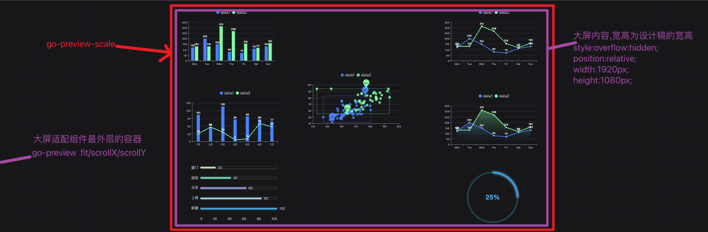
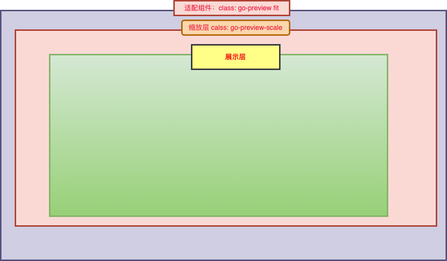
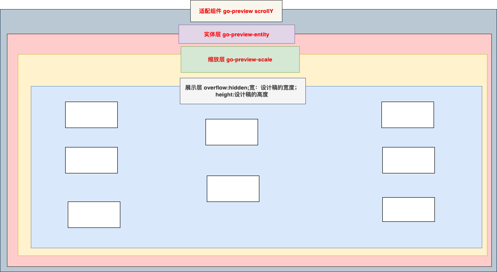

## 大屏适配统一组件
大屏适配一般方案：vw/vh,百分比，rem

### 大体思路
  采用 `transform: scale(0.425, 0.425)`的方式
  

  - fit: 自适应，中部居中
  - scrollX：Y轴铺满，X轴滚动
  - scrollY:X轴铺满，Y轴滚动

#### 自适应模式 fit

```css
  .go-preview{
    position: relative;
    height: 100vh;
    width: 100vw;
  }
  .go-preview.fit{
    display: flex;
    align-items: center;
    justify-content: center;
    overflow: hidden;
  }
  .go-preview.fit .go-preview-scale{
    transform-origin: center center;
    transform: scale(0.35648, 0.35648);
  }
```

```css
.go-preview{
    position: relative;
    height: 100vh;
    width: 100vw;
}
.go-preview.scrollY{
    overflow-x: hidden;
}
.go-preview.go-preview-entity{
  overflow:hidden;
  height: 设计稿高度;
  width: 设计稿宽度;
}
.go-preview.scrollY .go-preview-scale{
  transform: scale(0.35648, 0.35648);
  transform-origin: left top;
}
```


代码如下：
```vue
<template>
  <div :class="`go-preview ${chartEditStore.editCanvasConfig.previewScaleType}`" @mousedown="dragCanvas">
    <template v-if="showEntity">
      <!-- 实体区域 -->
      <div ref="entityRef" class="go-preview-entity">
        <!-- 缩放层 -->
        <div ref="previewRef" class="go-preview-scale">
          <!-- 展示层 -->
          <div :style="previewRefStyle" v-if="show">
            <!-- 渲染层 -->
            <preview-render-list></preview-render-list>
          </div>
        </div>
      </div>
    </template>
    <template v-else>
      <!-- 缩放层 -->
      <div ref="previewRef" class="go-preview-scale">
        <!-- 展示层 -->
        <div :style="previewRefStyle" v-if="show">
          <!-- 渲染层 -->
          <preview-render-list></preview-render-list>
        </div>
      </div>
    </template>
  </div>
</template>

<script setup lang="ts">
import { computed } from 'vue'
import { PreviewRenderList } from './components/PreviewRenderList'
import { getFilterStyle, setTitle } from '@/utils'
import { getEditCanvasConfigStyle, getSessionStorageInfo, keyRecordHandle, dragCanvas } from './utils'
import { useComInstall } from './hooks/useComInstall.hook'
import { useScale } from './hooks/useScale.hook'
import { useStore } from './hooks/useStore.hook'
import { PreviewScaleEnum } from '@/enums/styleEnum'
import type { ChartEditStorageType } from './index.d'
import { useChartEditStore } from '@/store/modules/chartEditStore/chartEditStore'

// const localStorageInfo: ChartEditStorageType = getSessionStorageInfo() as ChartEditStorageType

await getSessionStorageInfo()
const chartEditStore = useChartEditStore() as unknown as ChartEditStorageType

setTitle(`预览-${chartEditStore.editCanvasConfig.projectName}`)

const previewRefStyle = computed(() => {
  return {
    overflow: 'hidden',
    ...getEditCanvasConfigStyle(chartEditStore.editCanvasConfig),
    ...getFilterStyle(chartEditStore.editCanvasConfig)
  }
})

const showEntity = computed(() => {
  const type = chartEditStore.editCanvasConfig.previewScaleType
  return type === PreviewScaleEnum.SCROLL_Y || type === PreviewScaleEnum.SCROLL_X
})

useStore(chartEditStore)
const { entityRef, previewRef } = useScale(chartEditStore)
const { show } = useComInstall(chartEditStore)

// 开启键盘监听
keyRecordHandle()
</script>

<style lang="scss" scoped>
@include go('preview') {
  position: relative;
  height: 100vh;
  width: 100vw;
  @include background-image('background-image');
  &.fit,
  &.full {
    display: flex;
    align-items: center;
    justify-content: center;
    overflow: hidden;
    .go-preview-scale {
      transform-origin: center center;
    }
  }
  &.scrollY {
    overflow-x: hidden;
    .go-preview-scale {
      transform-origin: left top;
    }
  }
  &.scrollX {
    overflow-y: hidden;
    .go-preview-scale {
      transform-origin: left top;
    }
  }
  .go-preview-entity {
    overflow: hidden;
  }
}
</style>

```
useScale.hooks
```ts
import { ref, provide, onMounted, onUnmounted } from 'vue'
import { usePreviewFitScale, usePreviewScrollYScale, usePreviewScrollXScale, usePreviewFullScale } from '@/hooks/index'
import type { ChartEditStorageType } from '../index.d'
import { PreviewScaleEnum } from '@/enums/styleEnum'

export const SCALE_KEY = 'scale-value'

export const useScale = (localStorageInfo: ChartEditStorageType) => {
  const entityRef = ref()
  const previewRef = ref()
  const width = ref(localStorageInfo.editCanvasConfig.width)
  const height = ref(localStorageInfo.editCanvasConfig.height)
  const scaleRef = ref({ width: 1, height: 1 })

  provide(SCALE_KEY, scaleRef)

  // 监听鼠标滚轮 +ctrl 键
  const useAddWheelHandle = (removeEvent: Function) => {
    addEventListener(
      'wheel',
      (e: any) => {
        if (window?.$KeyboardActive?.ctrl) {
          e.preventDefault()
          e.stopPropagation()
          removeEvent()
          const transform = previewRef.value?.style.transform
          const regRes = transform.match(/scale\((\d+\.?\d*)*/) as RegExpMatchArray
          const width = regRes[1]
          const previewBoxDom = document.querySelector('.go-preview') as HTMLElement
          const entityDom = document.querySelector('.go-preview-entity') as HTMLElement
          if (previewBoxDom) {
            previewBoxDom.style.overflow = 'unset'
            previewBoxDom.style.position = 'absolute'
          }
          if (entityDom) {
            entityDom.style.overflow = 'unset'
          }

          if (e.wheelDelta > 0) { // 滚轮放大
            const resNum = parseFloat(Number(width).toFixed(2))
            previewRef.value.style.transform = `scale(${resNum > 5 ? 5 : resNum + 0.1})` // 最大放大5倍
          } else {// 滚轮缩小
            const resNum = parseFloat(Number(width).toFixed(2))
            previewRef.value.style.transform = `scale(${resNum < 0.2 ? 0.2 : resNum - 0.1})` // 最小缩小到0.2
          }
        }
      },
      { passive: false }
    )
  }

  const updateScaleRef = (scale: { width: number; height: number }) => {
    // 这里需要解构，保证赋值给scaleRef的为一个新对象
    // 因为scale始终为同一引用
    scaleRef.value = { ...scale }
  }

  // 屏幕适配
  onMounted(() => {
    switch (localStorageInfo.editCanvasConfig.previewScaleType) {
      case PreviewScaleEnum.FIT:
        ;(() => {
          const { calcRate, windowResize, unWindowResize } = usePreviewFitScale(
            width.value as number,
            height.value as number,
            previewRef.value,
            updateScaleRef
          )
          calcRate()
          windowResize()
          useAddWheelHandle(unWindowResize)
          onUnmounted(() => {
            unWindowResize()
          })
        })()
        break
      case PreviewScaleEnum.SCROLL_Y:
        ;(() => {
          const { calcRate, windowResize, unWindowResize } = usePreviewScrollYScale(
            width.value as number,
            height.value as number,
            previewRef.value,
            scale => {
              const dom = entityRef.value
              dom.style.width = `${width.value * scale.width}px`
              dom.style.height = `${height.value * scale.height}px`
              updateScaleRef(scale)
            }
          )
          calcRate()
          windowResize()
          useAddWheelHandle(unWindowResize)
          onUnmounted(() => {
            unWindowResize()
          })
        })()

        break
      case PreviewScaleEnum.SCROLL_X:
        ;(() => {
          const { calcRate, windowResize, unWindowResize } = usePreviewScrollXScale(
            width.value as number,
            height.value as number,
            previewRef.value,
            scale => {
              const dom = entityRef.value
              dom.style.width = `${width.value * scale.width}px`
              dom.style.height = `${height.value * scale.height}px`
              updateScaleRef(scale)
            }
          )
          calcRate()
          windowResize()
          useAddWheelHandle(unWindowResize)
          onUnmounted(() => {
            unWindowResize()
          })
        })()

        break
      case PreviewScaleEnum.FULL:
        ;(() => {
          const { calcRate, windowResize, unWindowResize } = usePreviewFullScale(
            width.value as number,
            height.value as number,
            previewRef.value,
            updateScaleRef
          )
          calcRate()
          windowResize()
          useAddWheelHandle(unWindowResize)
          onUnmounted(() => {
            unWindowResize()
          })
        })()
        break
    }
  })

  return {
    entityRef,
    previewRef,
    scaleRef
  }
}

```

usePreviewScale.hook
```ts
import throttle from 'lodash/throttle'

// 拆出来是为了更好的分离单独复用

// * 屏幕缩放适配（两边留白）
export const usePreviewFitScale = (
  width: number,
  height: number,
  scaleDom: HTMLElement | null,
  callback?: (scale: {
    width: number;
    height: number;
  }) => void
) => {
  // * 画布尺寸（px）
  const baseWidth = width
  const baseHeight = height

  // * 默认缩放值
  const scale = {
    width: 1,
    height: 1,
  }

  // * 需保持的比例
  const baseProportion = parseFloat((baseWidth / baseHeight).toFixed(5))
  const calcRate = () => {
    // 当前屏幕宽高比
    const currentRate = parseFloat(
      (window.innerWidth / window.innerHeight).toFixed(5)
    )
    if (scaleDom) {
      if (currentRate > baseProportion) {
        // 表示更宽
        scale.width = parseFloat(((window.innerHeight * baseProportion) / baseWidth).toFixed(5))
        scale.height = parseFloat((window.innerHeight / baseHeight).toFixed(5))
        scaleDom.style.transform = `scale(${scale.width}, ${scale.height})`
      } else {
        // 表示更高
        scale.height = parseFloat(((window.innerWidth / baseProportion) / baseHeight).toFixed(5))
        scale.width = parseFloat((window.innerWidth / baseWidth).toFixed(5))
        scaleDom.style.transform = `scale(${scale.width}, ${scale.height})`
      }
      if (callback) callback(scale)
    }
  }

  const resize = throttle(() => {
    calcRate()
  }, 200)

  // * 改变窗口大小重新绘制
  const windowResize = () => {
    window.addEventListener('resize', resize)
  }

  // * 卸载监听
  const unWindowResize = () => {
    window.removeEventListener('resize', resize)
  }

  return {
    calcRate,
    windowResize,
    unWindowResize,
  }
}

// *  X轴撑满，Y轴滚动条
export const usePreviewScrollYScale = (
  width: number,
  height: number,
  scaleDom: HTMLElement | null,
  callback?: (scale: {
    width: number;
    height: number;
  }) => void
) => {
  // * 画布尺寸（px）
  const baseWidth = width
  const baseHeight = height

  // * 默认缩放值
  const scale = {
    width: 1,
    height: 1,
  }

  // * 需保持的比例
  const baseProportion = parseFloat((baseWidth / baseHeight).toFixed(5))
  const calcRate = () => {
    if (scaleDom) {
      scale.height = parseFloat(((window.innerWidth / baseProportion) / baseHeight).toFixed(5))
      scale.width = parseFloat((window.innerWidth / baseWidth).toFixed(5))
      scaleDom.style.transform = `scale(${scale.width}, ${scale.height})`
      if (callback) callback(scale)
    }
  }

  const resize = throttle(() => {
    calcRate()
  }, 200)

  // * 改变窗口大小重新绘制
  const windowResize = () => {
    window.addEventListener('resize', resize)
  }

  // * 卸载监听
  const unWindowResize = () => {
    window.removeEventListener('resize', resize)
  }

  return {
    calcRate,
    windowResize,
    unWindowResize,
  }
}

// *  Y轴撑满，X轴滚动条
export const usePreviewScrollXScale = (
  width: number,
  height: number,
  scaleDom: HTMLElement | null,
  callback?: (scale: {
    width: number;
    height: number;
  }) => void
) => {
  // * 画布尺寸（px）
  const baseWidth = width
  const baseHeight = height

  // * 默认缩放值
  const scale = {
    height: 1,
    width: 1,
  }

  // * 需保持的比例
  const baseProportion = parseFloat((baseWidth / baseHeight).toFixed(5))
  const calcRate = () => {
    if (scaleDom) {
      scale.width = parseFloat(((window.innerHeight * baseProportion) / baseWidth).toFixed(5))
      scale.height = parseFloat((window.innerHeight / baseHeight).toFixed(5))
      scaleDom.style.transform = `scale(${scale.width}, ${scale.height})`
      if (callback) callback(scale)
    }
  }

  const resize = throttle(() => {
    calcRate()
  }, 200)

  // * 改变窗口大小重新绘制
  const windowResize = () => {
    window.addEventListener('resize', resize)
  }

  // * 卸载监听
  const unWindowResize = () => {
    window.removeEventListener('resize', resize)
  }

  return {
    calcRate,
    windowResize,
    unWindowResize,
  }
}

// * 变形内容，宽高铺满
export const usePreviewFullScale = (
  width: number,
  height: number,
  scaleDom: HTMLElement | null,
  callback?: (scale: {
    width: number;
    height: number;
  }) => void
) => {

  // * 默认缩放值
  const scale = {
    width: 1,
    height: 1,
  }

  const calcRate = () => {
    if (scaleDom) {
      scale.width = parseFloat((window.innerWidth / width).toFixed(5))
      scale.height = parseFloat((window.innerHeight / height).toFixed(5))
      scaleDom.style.transform = `scale(${scale.width}, ${scale.height})`
      if (callback) callback(scale)
    }
  }

  const resize = throttle(() => {
    calcRate()
  }, 200)

  // * 改变窗口大小重新绘制
  const windowResize = () => {
    window.addEventListener('resize', resize)
  }

  // * 卸载监听
  const unWindowResize = () => {
    window.removeEventListener('resize', resize)
  }

  return {
    calcRate,
    windowResize,
    unWindowResize,
  }
}
```