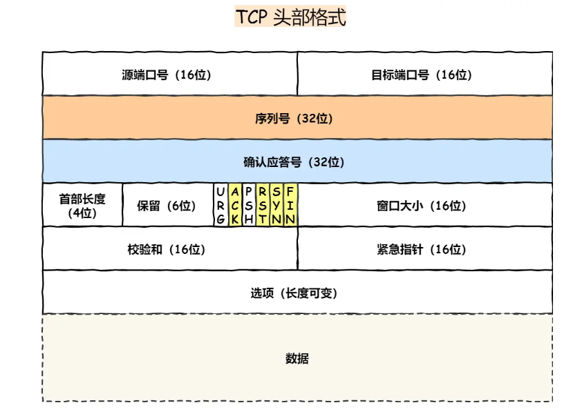

# 网络相关

## 1. 网络模型架构


## 2. TCP基本认识



<font color="blue">序列号：</font>在建立连接时由计算机生成的随机数作为其初始值，通过 SYN 包传给接收端主机，每发送一次数据，就「累加」一次该「数据字节数」的大小。<font color="blue">用来解决网络包乱序问题。</font>

<font color="blue">确认应答号：</font>指下一次「期望」收到的数据的序列号，发送端收到这个确认应答以后可以认为在这个序号以前的数据都已经被正常接收。<font color="blue">用来解决丢包的问题。</font>

<font color="blue">控制位：</font>

- ACK：该位为 1 时，「确认应答」的字段变为有效，TCP 规定除了最初建立连接时的 SYN 包之外该位必须设置为 1 。
- RST：该位为 1 时，表示 TCP 连接中出现异常必须强制断开连接。
- SYN：该位为 1 时，表示希望建立连接，并在其「序列号」的字段进行序列号初始值的设定。
- FIN：该位为 1 时，表示今后不会再有数据发送，希望断开连接。当通信结束希望断开连接时，通信双方的主机之间就可以相互交换 FIN 位为 1 的 TCP 段。

## 3. UDP 基本认识


## 4. 什么是TCP、UDP,二者的区别

<font color="blue">TCP 是面向连接的、可靠的、基于字节流的传输层通信协议。</font>

### 什么是连接？

用于保证可靠性和流量控制维护的某些状态信息，这些信息的组合，包括 Socket、序列号和窗口大小称为连接。

所以我们可以知道，建立一个 TCP 连接是需要客户端与服务端达成上述三个信息的共识。

- Socket：由 IP 地址和端口号组成
- 序列号：用来解决乱序问题等
- 窗口大小：用来做流量控制

### 如何唯一确定一个 TCP 连接呢？

TCP 四元组可以唯一的确定一个连接，四元组包括如下：

- 源地址
- 源端口
- 目的地址
- 目的端口

二者直接的区别从以下几个方面来说

1. 连接
   - TCP是面向连接的传输层协议，传输数据前要先建立连接。
   - UDP不需要连接，即可传输数据。
2. 服务对象
   - TCP 是一对一的两点服务，即一条连接只有两个端点。
   - UDP 支持一对一、一对多、多对多的交互通信。
3. 可靠性
   - TCP是可靠交付数据的，数据可以无差错、不丢失、不重复、按需到达。
   - UDP是尽最大努力交付，不保证可靠交付数据，存在丢包数据丢失的可能。
4. 拥塞控制、流量控制
   - TCP有拥塞控制和流量控制，保证数据传输安全性。
   - UDP没有，即使网络非常拥堵，也不会影响UDP的发送速率。
5. 首部开销
    - TCP首部长度较长，会有一定的开销
    - UDP首部只有8个字节，固定不变，开销较小
6. 传输方式
    - TCP 是流式传输，没有边界，但保证顺序可可靠
    - UDP 是一个包一个包的发送，是有边界的，但可能会丢包和乱序。
7. 分片不同
    - TCP 的数据大小大于MSS大小，则会在传输层进行分片。目标主机收到后，也同样在传输层组装TCP数据包，如果中途丢失一个分片，只需要传输丢失的这个分片。
    - UDP 的数据大小如果大于MTU大小，则会在IP层进行分片，目标主机收到后，在IP层组装完数据再传给传输层。
  
## 5. TCP 三次握手过程


- 一开始，客户端和服务端都处于 `CLOSE` 状态。先是服务端主动监听某个端口，处于 `LISTEN` 状态


- 客户端会随机初始化序号（`client_isn`），将此序号置于 TCP 首部的「序号」字段中，同时把 `SYN` 标志位置为 1，表示 `SYN` 报文。接着把第一个 `SYN` 报文发送给服务端，表示向服务端发起连接，该报文不包含应用层数据，之后客户端处于 `SYN-SENT` 状态。


- 服务端收到客户端的 `SYN` 报文后，首先服务端也随机初始化自己的序号（`server_isn`），将此序号填入 TCP 首部的「序号」字段中，其次把 TCP 首部的「确认应答号」字段填入 `client_isn + 1`, 接着把 `SYN` 和 `ACK` 标志位置为 1。最后把该报文发给客户端，该报文也不包含应用层数据，之后服务端处于 `SYN-RCVD` 状态。


- 客户端收到服务端报文后，还要向服务端回应最后一个应答报文，首先该应答报文 TCP 首部 `ACK` 标志位置为 1 ，其次「确认应答号」字段填入 `server_isn + 1` ，最后把报文发送给服务端，这次报文可以携带客户到服务端的数据，之后客户端处于 `ESTABLISHED` 状态。

- 服务端收到客户端的应答报文后，也进入 `ESTABLISHED` 状态。

从上面的过程可以发现<font color="blue">第三次握手是可以携带数据的，前两次握手是不可以携带数据的</font>


### 为什么是三次握手？不是两次、四次？

在前面我们知道了什么是 TCP 连接：

- 用于保证可靠性和流量控制维护的某些状态信息，这些信息的组合，包括 Socket、序列号和窗口大小称为连接。

所以，重要的是<font color="blue">为什么三次握手才可以初始化 Socket、序列号和窗口大小并建立 TCP 连接。</font>

接下来，以三个方面分析三次握手的原因：

- 三次握手才可以阻止重复历史连接的初始化（主要原因）
- 三次握手才可以同步双方的初始序列号
- 三次握手才可以避免资源浪费

<font color="#c849ff">原因一：避免历史连接</font>

我们考虑一个场景，客户端先发送了 SYN（seq = 90）报文，然后客户端宕机了，而且这个 SYN 报文还被网络阻塞了，服务端并没有收到，接着客户端重启后，又重新向服务端建立连接，发送了 SYN（seq = 100）报文（注意！不是重传 SYN，重传的 SYN 的序列号是一样的）。


客户端连续发送多次 SYN（都是同一个四元组）建立连接的报文，在网络拥堵情况下：

- 一个「旧 SYN 报文」比「最新的 SYN」 报文早到达了服务端，那么此时服务端就会回一个 SYN + ACK 报文给客户端，此报文中的确认号是 91（90+1）。
- 客户端收到后，发现自己期望收到的确认号应该是 100 + 1，而不是 90 + 1，于是就会回 RST 报文。
- 服务端收到 RST 报文后，就会释放连接。
- 后续最新的 SYN 抵达了服务端后，客户端与服务端就可以正常的完成三次握手了。
  
上述中的「旧 SYN 报文」称为历史连接，TCP 使用三次握手建立连接的最主要原因就是<font color="blue">防止「历史连接」初始化了连接。</font>

```html
有很多人问，如果服务端在收到 RST 报文之前，先收到了「新 SYN 报文」，也就是服务端收到客户端报文的顺序是：「旧 SYN 报文」->「新 SYN 报文」，此时会发生什么?

当服务端第一次收到 SYN 报文，也就是收到 「旧 SYN 报文」时，就会回复 SYN + ACK 报文给客户端，此报文中的确认号是 91（90+1）。

然后这时再收到「新 SYN 报文」时，就会回 Challenge Ack 报文给客户端，这个 ack 报文并不是确认收到「新 SYN 报文」的，而是上一次的 ack 确认号，也就是91（90+1）。所以客户端收到此 ACK 报文时，发现自己期望收到的确认号应该是 101，而不是 91，于是就会回 RST 报文。
```

<font color="blue">如果是两次握手连接，就无法阻止历史连接</font>，那为什么 TCP 两次握手为什么无法阻止历史连接呢？

我先直接说结论，主要是因为在<font color="blue">两次握手的情况下，服务端没有中间状态给客户端来阻止历史连接，导致服务端可能建立一个历史连接，造成资源浪费。</font>


可以看到，如果采用两次握手建立 TCP 连接的场景下，服务端在向客户端发送数据前，并没有阻止掉历史连接，导致服务端建立了一个历史连接，又白白发送了数据，妥妥地浪费了服务端的资源。

因此，<font color="blue">要解决这种现象，最好就是在服务端发送数据前，也就是建立连接之前，要阻止掉历史连接，这样就不会造成资源浪费，而要实现这个功能，就需要三次握手。</font>

<font color="#c849ff">原因二：同步双方初始序列号</font>

TCP 协议的通信双方， 都必须维护一个「序列号」， 序列号是可靠传输的一个关键因素，它的作用：

- 接收方可以去除重复的数据；
- 接收方可以根据数据包的序列号按序接收；
- 可以标识发送出去的数据包中， 哪些是已经被对方收到的（通过 ACK 报文中的序列号知道）；


<font color="#c849ff">原因三：避免资源浪费</font>

如果只有「两次握手」，当客户端发生的 SYN 报文在网络中阻塞，客户端没有接收到 ACK 报文，就会重新发送 SYN ，由于没有第三次握手，服务端不清楚客户端是否收到了自己回复的 ACK 报文，所以服务端每收到一个 SYN 就只能先主动建立一个连接，这会造成什么情况呢？

如果客户端发送的 SYN 报文在网络中阻塞了，重复发送多次 SYN 报文，那么服务端在收到请求后就会建立多个冗余的无效链接，造成不必要的资源浪费。


即两次握手会造成消息滞留情况下，服务端重复接受无用的连接请求 SYN 报文，而造成重复分配资源。

#### 小结

TCP 建立连接时，通过三次握手能<font color="blue">防止历史连接的建立，能减少双方不必要的资源开销，能帮助双方同步初始化序列号。</font>序列号能够保证数据包不重复、不丢弃和按序传输。

不使用「两次握手」和「四次握手」的原因：

- 「两次握手」：无法防止历史连接的建立，会造成双方资源的浪费，也无法可靠的同步双方序列号；
- 「四次握手」：三次握手就已经理论上最少可靠连接建立，所以不需要使用更多的通信次数。

### 为什么每次建立 TCP 连接时，初始化的序列号都要求不一样呢？

- 为了防止历史报文被下一个相同四元组的连接接收（主要方面）；
- 为了安全性，防止黑客伪造的相同序列号的 TCP 报文被对方接收；

## 6. 四次挥手


- 客户端打算关闭连接，此时会发送一个 TCP 首部 FIN 标志位被置为 1 的报文，也即 FIN 报文，之后客户端进入 FIN_WAIT_1 状态。
- 服务端收到该报文后，就向客户端发送 ACK 应答报文，接着服务端进入 CLOSE_WAIT 状态。
- 客户端收到服务端的 ACK 应答报文后，之后进入 FIN_WAIT_2 状态。
- 等待服务端处理完数据后，也向客户端发送 FIN 报文，之后服务端进入 LAST_ACK 状态。
- 客户端收到服务端的 FIN 报文后，回一个 ACK 应答报文，之后进入 TIME_WAIT 状态
- 服务端收到了 ACK 应答报文后，就进入了 CLOSE 状态，至此服务端已经完成连接的关闭。
- 客户端在经过 2MSL 一段时间后，自动进入 CLOSE 状态，至此客户端也完成连接的关闭。

每个方向都需要一个 FIN 和一个 ACK，因此通常被称为四次挥手。
主动关闭连接的，才有 TIME_WAIT 状态。

### 为什么挥手需要四次？

- 关闭连接时，客户端向服务端发送 FIN 时，仅仅表示客户端不再发送数据了但是还能接收数据。
- 服务端收到客户端的 FIN 报文时，先回一个 ACK 应答报文，而服务端可能还有数据需要处理和发送，等服务端不再发送数据时，才发送 FIN 报文给客户端来表示同意现在关闭连接。


### TCP 四次挥手，可以变成三次吗？

在一些情况下， TCP 四次挥手是可以变成 TCP 三次挥手的。

为什么 TCP 挥手需要四次呢？
服务器收到客户端的 FIN 报文时，内核会马上回一个 ACK 应答报文，但是服务端应用程序可能还有数据要发送，所以并不能马上发送 FIN 报文，而是将发送 FIN 报文的控制权交给服务端应用程序：

- 如果服务端应用程序有数据要发送的话，就发完数据后，才调用关闭连接的函数；
- 如果服务端应用程序没有数据要发送的话，可以直接调用关闭连接的函数，

从上面过程可知，**是否要发送第三次挥手的控制权不在内核，而是在被动关闭方（上图的服务端）的应用程序，因为应用程序可能还有数据要发送，由应用程序决定什么时候调用关闭连接的函数，当调用了关闭连接的函数，内核就会发送 FIN 报文了，**所以服务端的 ACK 和 FIN 一般都会分开发送。

### 什么情况会出现三次挥手？

当被动关闭方（上图的服务端）在 TCP 挥手过程中，「没有数据要发送」并且「开启了 TCP 延迟确认机制」，那么第二和第三次挥手就会合并传输，这样就出现了三次挥手。

然后因为 TCP 延迟确认机制是默认开启的，所以导致我们抓包时，看见三次挥手的次数比四次挥手还多。