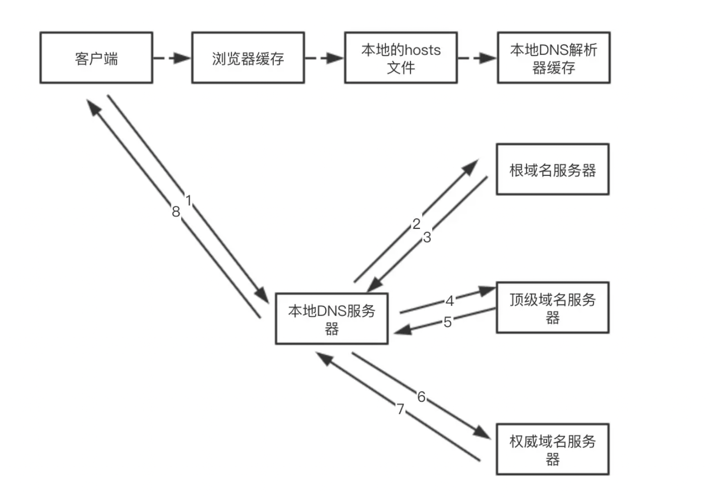

# 软技能面试题集合

## 1.SVN和Git优缺点对比

### SVN

svn是集中式版本控制系统，版本库是集中放在中央服务器的，集中式版本控制系统必须联网。

优点

- 管理方便

- 集中式服务器更能保证安全性

- 代码一致性高
  
缺点
  
- 服务器压力大，单点故障

- 不能连接到服务器上，基本上不可以工作

- 不适合开发人员多的项目开发(但是集中式版本控制系统明确的权限管理机制，可以实现分层管理，从而很好的解决开发人数众多的问题)

### GIT

git是分布式版本控制系统，因为没有中央服务器，因此工作时无需联网，干完活直接推送即可。

优点

- 适合分布式开发

- 公共服务器压力和数据量不会太大

- 速度快、灵活

- 任意2个开发者之间可以很容易的解决冲突

- 支持离线工作

缺点

- 学习周期长

- 代码保密性差

## 2.浏览器输入url到页面展示经历了什么？

  1. URL解析
  2. DNS查询：DNS服务器（域名解析系统）会根据用户提供的域名查找对应的IP地址
    - 检查浏览器缓存 > 检查hosts文件 > 本地DNS解析器缓存 > 本地DNS服务器
  3. TCP连接(三次握手)
  4. 发送请求，服务器处理，返回响应结果
  5. 关闭tcp连接，4次挥手
  6. 浏览器渲染

   DNS解析过程如下
   

### 在查找过程中，有以下优化点

- DNS存在着多级缓存，从离浏览器的距离排序的话，有以下几种: 浏览器缓存，系统缓存，路由器缓存，IPS服务器缓存，根域名服务器缓存，顶级域名服务器缓存，主域名服务器缓存。
- 在域名和 IP 的映射过程中，给了应用基于域名做负载均衡的机会，可以是简单的负载均衡，也可以根据地址和运营商做全局的负载均衡。

### 进行三次握手，建立TCP连接

1. 第一次握手：建立连接。客户端发送连接请求报文段，将SYN位置为1，Sequence Number为x；然后，客户端进入SYN_SEND状态，等待服务器的确认；

2. 第二次握手：服务器收到SYN报文段。服务器收到客户端的SYN报文段，需要对这个SYN报文段进行确认，设置Acknowledgment Number为x+1(Sequence Number+1)；同时，自己还要发送SYN请求信息，将SYN位置为1，Sequence Number为y；服务器端将上述所有信息放到一个报文段（即SYN+ACK报文段）中，一并发送给客户端，此时服务器进入SYN_RECV状态；

3. 第三次握手：客户端收到服务器的SYN+ACK报文段。然后将Acknowledgment Number设置为y+1，向服务器发送ACK报文段，这个报文段发送完毕以后，客户端和服务器端都进入ESTABLISHED状态，完成TCP三次握手。

### SSL握手过程

1. 第一阶段 建立安全能力 包括协议版本 会话Id 密码构件 压缩方法和初始随机数
2. 第二阶段 服务器发送证书 密钥交换数据和证书请求，最后发送请求-相应阶段的结束信号
3. 第三阶段 如果有证书请求客户端发送此证书 之后客户端发送密钥交换数据 也可以发送证书验证消息
4. 第四阶段 变更密码构件和结束握手协议

备注

ACK：此标志表示应答域有效，就是说前面所说的TCP应答号将会包含在TCP数据包中；有两个取值：0和1，为1的时候表示应答域有效，反之为0。TCP协议规定，只有ACK=1时有效，也规定连接建立后所有发送的报文的ACK必须为1。

SYN(SYNchronization)：在连接建立时用来同步序号。当SYN=1而ACK=0时，表明这是一个连接请求报文。对方若同意建立连接，则应在响应报文中使SYN=1和ACK=1. 因此, SYN置1就表示这是一个连接请求或连接接受报文。

FIN(finis）即完，终结的意思， 用来释放一个连接。当 FIN = 1 时，表明此报文段的发送方的数据已经发送完毕，并要求释放连接。


### 关闭TCP连接

第一次分手：主机1（可以是客户端，也可以是服务器端），设置Sequence Number和Acknowledgment Number，向主机2发送一个FIN报文段；此时，主机1进入FIN_WAIT_1状态；这表示主机1没有数据要发送给主机2了；

第二次分手：主机2收到了主机1发送的FIN报文段，向主机1回一个ACK报文段，Acknowledgment Number为Sequence Number加1；主机1进入FIN_WAIT_2状态；主机2告诉主机1，我"同意"你的关闭请求；

第三次分手：主机2向主机1发送FIN报文段，请求关闭连接，同时主机2进入LAST_ACK状态；

第四次分手：主机1收到主机2发送的FIN报文段，向主机2发送ACK报文段，然后主机1进入TIME_WAIT状态；主机2收到主机1的ACK报文段以后，就关闭连接；此时，主机1等待2MSL后依然没有收到回复，则证明Server端已正常关闭，那好，主机1也可以关闭连接了。

### 浏览器渲染

按照渲染的时间顺序，流水线可分为如下几个子阶段：构建 DOM 树、样式计算、布局阶段、分层、栅格化和显示。


## 3.对于前端安全，你了解多少？说说你对XSS和CSRF的理解

XSS攻击全称跨站脚本攻击,一般有sql注入，js脚本注入。

### 可能导致

- 盗用Cookie
- 破坏页面的正常结构
- 插入广告等恶意内容
- D-doss攻击

### 预防措施

1. 对输入、输出结果进行必要的转义和过滤
2. 尽量使用post，使用get方式时对路径长度进行限制
3. 使用httponly禁止黑客通过脚本获取用户cookie数据，但这样无法完全阻止xss攻击，因为发送http请求并不需要主动获取cookie

csrf跨站请求伪造，顾名思义就是黑客伪装成用户身份来执行一些非用户自愿的恶意以及非法操作。注意，获取cookie是XSS做的事，CSRF的作用是借用cookie，并不能获取cookie。

### 预防措施

1. 验证码

2. Token 验证
   - 服务器发送给客户端一个token；
   - 客户端提交的表单中带着这个token。
   - 如果这个 token 不合法，那么服务器拒绝这个请求。
也可以把 token 隐藏在 http 的 head头中。

3. 判断请求的Referer是否正确
Referer 指的是页面请求来源。意思是，只接受本站的请求，服务器才做响应；如果不是，就拦截。

## 4.刷新和强制刷新有什么区别？说说你对两者的理解

从 http 协议的角度来看
F5 和 Ctrl+R 都是普通刷新，若页面之前访问过，就会发一个空请求到服务器，服务器返回 302 ，表示资源未更新，可以使用浏览器缓存。
强制刷新 (ctrl+F5) 则不管浏览器是否缓存，都要重新去源站服务器请求资源，成功则返回 200。
可以使用 chrome 开发工具查看具体过程，大概是这样一个流程，实际讲起来更复杂。

## 5.Git的reset和revert有什么区别？它们分别适用于什么场景？

区别

- reset是彻底回退到指定的commit版本，该commit后的所有commit都将被清除；而revert仅是撤销指定commit的修改，并不影响后续的commit。
- reset执行后不会产生记录，revert执行后会产生记录。
  
```md
  git reset 将某次提交后的版本全部抹除。

  0 ----> 0 ----> 0      --[git reset HEAD^]  0 -----> 0
  ^       ^       ^                           ^        ^
版本A    版本B   版本C [HEAD]                 版本A    版本B [HEAD]

版本C造成的更改直接抹除，无法在提交记录中查看


git revert 创建一次新的提交，将某次提交的更改撤销
  0 ----> 0 -----> 0      --[git revert HEAD]  0 -----> 0 ----> 0 ----> 0
  ^       ^        ^                           ^        ^       ^       ^
版本A   版本B    版本C [HEAD]                  版本A    版本B    版本C   版本D [HEAD]

版本D撤销了版本C的更改，它与版本B的内容是相同的
```
